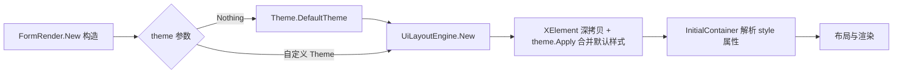

## 用户需求

为 LycheeUI 引擎实现主题系统 `src\LycheeUI\Theme.vb`，解决“控件未声明样式时以 0×0 尺寸渲染不可见”的 bug。

## 产品概述

主题系统通过一系列属性为各控件类型（button、input、a、label 等）定义默认 css 样式（宽度、高度、字体、字号、颜色、边框等）。渲染器构造时若无自定义主题则使用 `Theme.DefaultTheme()` 默认主题；主题样式只补充用户未声明的样式属性，用户在 UI 文档中显式书写的样式永远优先，保证已有界面外观完全不变。

## 核心功能

- `ElementTheme`：类型化 CSS 值属性（width/height/font/fontSize/background/color/border/shadow/padding/textAlign/display），可输出为 css 文本。
- `Theme`：按标签名映射控件默认样式（button/anchor/textbox/checkbox/radio/label/image），input 按 type 属性细分。
- `Theme.DefaultTheme()`：内置合理默认值，例如 button 默认 110×30、背景色、居中文本等。
- 主题接入渲染管线：`FormRender` 构造函数将主题传入 `UiLayoutEngine`，在解析 UI 文档前把默认样式合并进各元素缺失的 style 属性。
- 验证：`test\Form1.vb:115` 的 `<button id="no-css">` 应用默认主题后可正常渲染；已声明样式的控件外观不变。

## 技术方案

### 技术栈

- 纯 VB.NET（net10.0-windows），复用现有 sciBASIC html 渲染库（`Microsoft.VisualBasic.MIME.Html`），不改动渲染库。

### 实现思路

1. **重写 `src\LycheeUI\Theme.vb`**（修复现有骨架的类型错误：`button As Theme` 递归类型 → `ElementTheme`）：

- `ElementTheme`：新增 `width`、`height`、`fontSize`、`padding`、`textAlign`、`display` 属性；提供 `ToCss()` 把非空属性拼为 `name:value;` 文本（background→background-color、fontSize→font-size、shadow→box-shadow）。
- `Theme : Inherits ElementTheme`（继承属性用作 form 根元素默认样式）：按标签属性 `button`/`anchor`/`textbox`/`checkbox`/`radio`/`label`/`image`（均 `ElementTheme`）。
- `GetCss(tag, inputType)`：`a→anchor`、`img→image`、`input` 按 type 细分（text/password→textbox、checkbox→checkbox、radio→radio、button/submit/reset→button）、`form→继承属性`。
- `Apply(ui As XElement)`：递归遍历元素树，解析用户 style 属性已占用的属性 key 集合，主题 css 只保留用户未声明的属性后拼回 style 属性（补充在前、用户在后，**绝不产生重复 key**）。
- `DefaultTheme()`：返回内置默认主题实例（button: `width:110px;height:30px;background:#3B6EA5;color:#FFFFFF;border:1px solid #808080;text-align:center;display:block;font-size:13px`；textbox: `width:180px;height:26px;...`；根: `background:#FFFFFF;color:#202020` 等）。

2. **`src\LycheeUI\Layout\UiLayoutEngine.vb`**：构造函数改为 `Sub New(ui As XElement, Optional theme As Theme = Nothing)`；theme 非 Nothing 时对 UI 文档做深拷贝（`New XElement(ui)`，避免污染调用方 XElement）、调用 `theme.Apply(doc)` 后再 `New InitialContainer(doc)`。
3. **`src\LycheeUI\FormRender.vb`**：第 196 行改为 `layout = New UiLayoutEngine(ui, theme)`，使已解析的 theme 真正生效（第 190 行已有 `theme = If(theme, Theme.DefaultTheme)`）。

### 关键依据（已验证）

- `UiLayoutEngine` 全项目仅 `FormRender.vb:196` 一处构造。
- html 库从每个元素的 `style` 属性读取内联样式（`InitialContainer.vb:448-449`），这是唯一样式注入通道。
- CSS 解析器 `GetProperty()` 结果直接 `.ToDictionary(key, value)`，重复 key 会抛异常，故必须“只补缺”合并。

### 性能与可靠性

- 主题合并仅构造时一次 O(n) 树遍历，不进入每帧渲染路径。
- 深拷贝保证调用方 UI 文档不被修改；“只补缺”策略保证用户样式优先且无重复属性名风险。

