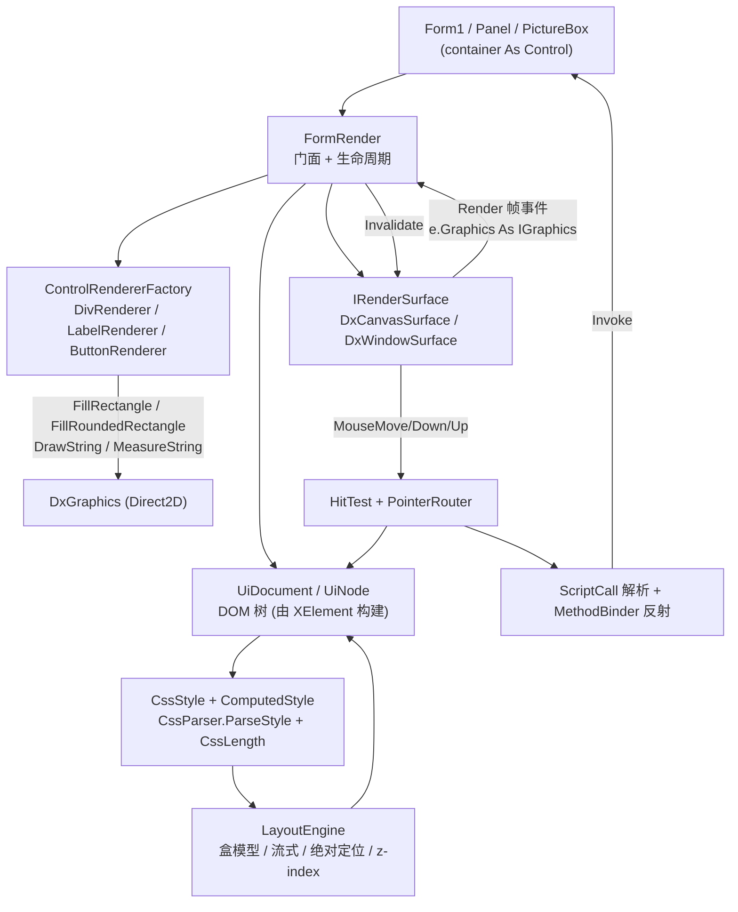

## 产品概述

在 `g:\lychee\src\LycheeUI` 中实现一套 VB.NET UI 引擎：界面用 VB XML 字面量形式的 HTML+CSS 声明，引擎负责解析布局声明、按容器尺寸实时计算每个控件的盒模型位置与样式、通过 DirectX 绘制到 WinForms 宿主控件上，并捕获相对坐标的鼠标事件，把 HTML 元素上的 `onclick` 表达式反射绑定到宿主窗体方法。

## 核心功能

- **声明式 UI**：宿主窗体以 `XElement`（XML 字面量）声明 `<form>` / `<div>` / `<label>` / `<button>` 及其 `style`、`onclick` 属性。
- **DirectX 渲染**：`New FormRender(ui, container)` 后自动在 container（Form / Panel / PictureBox）上建立 GPU 画布并逐帧绘制；容器尺寸变化实时重算布局重绘。
- **宿主抽象**：渲染后端抽象为 `IRenderSurface`，首版提供「嵌入 DxCanvas 子控件」实现，预留「DxWindowCanvas 直绘 container 句柄」实现。
- **样式与布局**：支持 `background-color`、`color`、`width/height`（px/%/em/pt/auto）、`left/top/right/bottom`（标准 CSS 绝对定位语义，% 相对父容器）、`padding`、`margin`、`border`、`border-radius`、`font-*`、`text-align`、`z-index`、`display`(block/inline)。
- **嵌套与流式**：div 容器嵌套布局；block 独占行向下排布，inline 同行向右、超宽换行；绝对定位元素脱离流并覆盖。
- **鼠标交互**：按绘制 z 序做命中测试判定鼠标所在控件，提供 hover / pressed 视觉反馈；`MouseMove/MouseDown/MouseUp/MouseClick` 全程接管。
- **脚本绑定**：解析 `onclick="clickButton()"` 与 `onclick="click2('aa+bb+cc')"`，在 container 及其父链上按 `Public Or NonPublic` 反射查找方法、按参数个数与类型转换匹配重载并调用。

## 技术栈

- **语言/框架**：VB.NET，`net10.0-windows`，WinForms（`UseWindowsForms=true`），x64。
- **DirectX**：`G:\Microsoft.VisualBasic.Drawing\src\DXApi\DXApi.vbproj`（`DxGraphics` / `DxWindowCanvas`，纯手写 P/Invoke COM，无第三方包）与 `...\src\DxCanvas\DxCanvas.vbproj`（`DxCanvas : Inherits UserControl`，`Render As DxRenderEventArgs`）。
- **HTML/CSS 解析**：`Microsoft.VisualBasic.MIME.Html`（`html_netcore5.vbproj`）的 `CssParser.ParseStyle` 与 CSS 值模型（`Padding`、`Stroke`、`CSSFont`）。
- **绘图/颜色**：`Microsoft.VisualBasic.Imaging` 的 `IGraphics`、`Brushes`、`Font`/`FontFace`、`GDIColors.TranslateColor`、`GeomTransform.CenterAlign`。
- **引用现状**：`LycheeUI.vbproj` 已引用上述全部项目，**无需新增 ProjectReference**。

## 实施方案

### 高层策略

`FormRender` 作为门面，内部拆成「渲染宿主 → DOM → 样式 → 布局 → 绘制 → 事件」六层，单向依赖：宿主产生帧事件 → 布局引擎按当前画布尺寸重算 `UiNode` 树 → 绘制器按 z 序在 `IGraphics` 上作画 → 事件层用同一棵树的 Bounds 做命中测试与反射调用。

### 关键技术决策（含权衡）

1. **DOM 直接由 `XElement` 构建，CSS 值解析复用 html 库**

- 理由：html 库唯一的 XElement 桥接 `Extensions.CreateDocument` 是 `xml.ToString()` 字符串往返（实体转义风险），且 `HtmlElement` **没有 Parent 引用**、`Children` 与文本节点混在 `HtmlElements` 里，无法支撑布局树的上下导航；而 VB 的 XML 字面量本身就是 `XElement`，天然具备 `Parent/Elements/Attributes`。
- 取舍：首版 DOM 走 `XElement`（零解析风险、性能最好），**CSS 内联样式仍走 `CssParser.ParseStyle`** 以复用既有库；预留 `UiDocument.FromHtml(htmlText)` 走 `HtmlDocument`，在后续需要 `<style>` 选择器级联/外部 .html 文件时启用。

2. **不自研 CSS 值解析器，但做适配层**：`CssParser.ParseStyle` 返回的 `Dictionary` 键已小写化，但缺键抛 `KeyNotFoundException`、含冒号 value（如 `url(http://...)`）会被丢弃。LycheeUI 内用 `CssStyle` 包装（一律 `TryGetValue`，未知属性忽略）。修复 `GetProperty` 归入后续对 html 库的迭代，不在首版阻塞。
3. **长度解析自研 `CssLength`**：不依赖 `CSSEnvirnment.GetValue`（em/in/cm/mm/pc 会 `Throw New NotImplementedException`，且 `CssLength("50%").Number` 是否归一化不明确）。自研结构明确存 0–100 的百分比值，`Resolve(base)` 时才 `/100*base`，支持 `auto/px/%/em/pt`。
4. **border-radius 走 DXApi 新增的原生圆角**：`ID2D1RenderTarget` 已有 slot18/19 的 `DrawRoundedRectangle`/`FillRoundedRectangle`，`ComBase.vb` 已有 `Friend Structure D2D1_ROUNDED_RECT{rect, radiusX, radiusY}` 与 `ToRectF` 助手，只需在 `DxGraphics.vb` 加两个薄封装（比 `GraphicsPath` 拼弧线更省事、更快、无 `DxPathBuilder` 对 arc 支持的不确定性）。绘制器通过 `TryCast(g, DxGraphics)` 调用，拿不到时降级为直角矩形——保证不因跨项目改动而卡住。
5. **渲染宿主双后端**：`IRenderSurface` 抽象帧事件与指针事件。首版 `DxCanvasSurface`（`Dock=Fill` + `container.Controls.Add`），复用 DxCanvas 已完成的设备创建/丢失重建/`OnSizeChanged`→`Resize`/Paint 循环；`DxWindowSurface` 首版给出骨架并在后续阶段补齐（需 `NativeWindow` 子类化拦截 `WM_ERASEBKGND`/`WM_PAINT`，否则 WinForms GDI 背景会盖掉 DX 画面）。

### 性能与可靠性

- 布局结果缓存：`Size` 未变且无 hover/pressed 状态变化时跳过 `Layout()`，避免每帧 O(n) 重算；命中测试是 O(n) 线性扫描（控件量级为几十，无需空间索引），按 z 序倒序提前命中即返回。
- `Font`/`Brush`/`Pen` 对象在 `ComputedStyle` 中缓存复用（DirectX 侧 `DxBrushCache` 以 `Name|Size|Bold|Italic` 为 key 缓存 `IDWriteTextFormat`，重复 `New Font` 不会重建 GPU 资源，但仍应避免每帧新建）。
- hover 状态变化时才 `Invalidate()`，避免无意义重绘；`MouseMove` 中命中结果未变则不触发重绘。
- 反射调用结果缓存 `MethodInfo`（`Dictionary(Of String, MethodInfo)`），避免每次点击做 `GetMethods` 全量扫描。
- 异常隔离：单个元素绘制异常不应中断整帧；反射调用失败写调试信息而非崩溃。

## 实施注意事项（防回归）

- **类型边界（极易踩坑）**：`Color/Rectangle/RectangleF/Point/PointF/Size/SizeF` 用 `System.Drawing`；`Font/Pen/Brush/SolidBrush` **必须**用 `Microsoft.VisualBasic.Imaging.*`（`DxGraphics.vb` 顶部用 `Imports` 别名强制替换了同名类型）。传 `System.Drawing.Font` 会编译失败。
- **重绘要用 `canvas.Invalidate()`**，不能用 `container.Invalidate()`——父窗口会把子窗口裁出自己的更新区（DxCanvasDemo 注释明确警示）。
- **STA**：DirectX + WinForms 必须 STA；检查 test 项目的入口是否有 `<STAThreadAttribute>`，缺失则补上。
- **构造时机**：`FormRender` 在 `Form1` 字段初始化器里构造，此时窗体句柄可能尚未创建——`Controls.Add` 在句柄未创建时是安全的，DxCanvas 的设备在首次 `OnPaint` 才建立，因此无需等到 `Load`。
- **工程配置**：`LycheeUI.vbproj` 的 `<StartupObject>LycheeUI.Form1</StartupObject>` 对库项目无意义，若编译报相关错误则删除该行；`MyType=WindowsFormsWithCustomSubSubMain` 与 `ApplicationEvents.vb` 保持不动。
- **测试用例容错**：`Form1.vb` 里两个 button id 都是 `hello`、第二个 style 有笔误 `button: 0`。引擎侧必须：不依赖 id 唯一（布局/命中测试走树遍历而非 id 索引）、未知 CSS 属性忽略。同时建议顺手把笔误改为 `bottom: 0`、id 改为 `hello`/`hello2`，让人肉验证时语义明确。
- **无人值守冒烟不能弹 `MessageBox`**：因此冒烟验证用独立的宿主窗体（方法改为写文件/控制台），不改动 `Form1.vb` 的交互行为。

## 架构设计



数据流：`XElement` → `UiDocument` 建树（每节点解析 `ComputedStyle`）→ 每次帧开始前若尺寸/状态脏则 `LayoutEngine.Layout(root, viewport)` 写入 `UiNode.BorderBounds/ContentBounds` → 绘制器按 `z-index`+文档序稳定排序遍历渲染 → 鼠标事件把客户区坐标交给 `HitTest` 找到 `UiNode` → 读 `onclick` → `ScriptCall.Parse` → `MethodBinder.Invoke`。

## 目录结构

```
g:\lychee\src\LycheeUI\
├── FormRender.vb                        # [MODIFY] 门面：串起宿主/DOM/布局/绘制/事件；实现 IDisposable，
│                                        #          暴露 Public Event OnClick 与调试用的 GetBounds/HitTest/SimulateClick；
│                                        #          订阅 container.Disposed 做清理。
├── LycheeUI.vbproj                      # [MODIFY] 视编译情况移除 <StartupObject>。
├── Render\
│   ├── IRenderSurface.vb                # [NEW] 渲染宿主抽象：Attach(container)/Invalidate()/Size/Handle/
│   │                                    #          Event Frame(Of RenderFrameEventArgs)/PointerDown/PointerMove/PointerUp；继承 IDisposable。
│   ├── RenderFrameEventArgs.vb          # [NEW] 帧事件数据：Graphics As IGraphics、Size/Width/Height。
│   ├── PointerEventArgs.vb              # [NEW] 指针事件数据：X/Y（客户区像素）、Button As MouseButtons。
│   ├── DxCanvasSurface.vb               # [NEW] 首选后端：内部 New DxCanvas With {.Dock=Fill, .AutoClear=False}，
│   │                                    #          container.Controls.Add；转发 Render 事件为 Frame；转发继承来的鼠标事件。
│   └── DxWindowSurface.vb               # [NEW] 备选后端骨架：DxWindowCanvas(container.Handle, w, h) + NativeWindow 子类化
│                                        #          拦截 WM_ERASEBKGND/WM_PAINT；本阶段先给出结构并在后续补齐。
├── Css\
│   ├── CssLength.vb                     # [NEW] Structure CssLength(Value, Unit: Auto/Pixel/Percent/Em/Point)；
│   │                                    #          Parse(text)、Resolve(base, em)、IsAuto。
│   ├── CssStyle.vb                      # [NEW] 包装 Selector.Properties 的只读取值器（TryGet/GetColor/GetLength/GetSingle），
│   │                                    #          键小写、未知属性忽略、含冒号 value 不解析也不报错。
│   ├── ComputedStyle.vb                 # [NEW] 计算后样式：Display/Position/Left/Right/Top/Bottom/Width/Height/
│   │                                    #          Padding/Margin/BorderWidth/BorderColor/BorderRadius/Background/
│   │                                    #          ForeColor/Font/TextAlign/ZIndex；含默认值与继承（color/font）。
│   └── StyleResolver.vb                 # [NEW] XElement.Attribute("style") + 父级 ComputedStyle → ComputedStyle；
│                                        #          走 GDIColors.TranslateColor（#f00 先走 HexColor.HexToColor）与 CSSFont.TryParse。
├── Dom\
│   ├── UiDocument.vb                    # [NEW] Shared FromXElement(xml) As UiNode（预留 FromHtml(htmlText) 走 HtmlDocument）。
│   └── UiNode.vb                        # [NEW] 布局树节点：Tag/Id/Text/Attributes/Style/Parent/Children/
│                                        #          BorderBounds/ContentBounds/Hover/Pressed/IsPositioned/Attribute(name)。
├── Layout\
│   ├── LayoutEngine.vb                  # [NEW] Layout(root, viewport)：流式游标（cursorX/cursorY/lineBottom）+ 绝对定位覆盖；
│   │                                    #          递归子节点（传入减去 padding/border 的 content box）；Flatten() 按 z-index 排序输出绘制序列。
│   └── BoxMetrics.vb                    # [NEW] 盒模型度量助手：外框/内框换算、MeasureText(g, node) 自动宽高、
│                                        #          GeomTransform.CenterAlign 做 text-align。
├── Controls\
│   ├── IControlRenderer.vb              # [NEW] Interface IControlRenderer：Sub Render(g As IGraphics, node As UiNode)。
│   ├── DivRenderer.vb                   # [NEW] 画背景（含圆角）与边框，不画文本。
│   ├── LabelRenderer.vb                 # [NEW] 文本绘制 + text-align + 自动换行（WordWrap 可选）。
│   ├── ButtonRenderer.vb                # [NEW] 背景（圆角）+ 边框 + 居中/对齐文本；hover/pressed 状态用
│   │                                    #          GraphicsExtensions.Opacity 调整填充色。
│   └── ControlRendererFactory.vb        # [NEW] 标签名 → 渲染器映射表；未注册标签回退 DivRenderer。
└── Event\
    ├── HitTest.vb                       # [NEW] HitTest(root, x, y) As UiNode：按绘制 z 序倒序，BorderBounds.Contains 首个命中。
    ├── ScriptCall.vb                    # [NEW] ScriptCall.Parse(expr)：方法名 + 参数字面量数组（去引号、支持单/双引号与逗号分隔）。
    └── MethodBinder.vb                  # [NEW] 在 container 及 Parent 链上按 Instance|Public|NonPublic 查找方法，
                                         #          按参数个数+可转换类型匹配重载，做 String/Integer/Double/Boolean/DateTime 转换并缓存 MethodInfo。

g:\lychee\test\
├── Form1.vb                             # [MODIFY] 建议修正 button:0 → bottom:0、重复 id → hello/hello2（引擎侧仍需容错）。
└── Smoke.vb                             # [NEW] --smoke 无人值守冒烟：STA 线程内建独立宿主窗体（不弹 MessageBox），
                                         #          Show → DoEvents 若干帧 → 断言两个 button 的 Bounds →
                                         #          SimulateClick 验证反射调用 → SaveImage 输出 smoke.png → 退出码。

G:\Microsoft.VisualBasic.Drawing\src\DXApi\DxGraphics.vb     # [MODIFY] 新增公开 FillRoundedRectangle / DrawRoundedRectangle 重载。
```

## 关键代码结构

```
' Render\IRenderSurface.vb —— 渲染宿主抽象，屏蔽 DxCanvas 子控件与 DxWindowCanvas 直绘两种实现
Public Interface IRenderSurface
    Inherits IDisposable

    ReadOnly Property Size As Size
    ReadOnly Property Handle As IntPtr

    Event Frame As EventHandler(Of RenderFrameEventArgs)
    Event PointerDown As EventHandler(Of PointerEventArgs)
    Event PointerMove As EventHandler(Of PointerEventArgs)
    Event PointerUp As EventHandler(Of PointerEventArgs)

    Sub Attach(container As System.Windows.Forms.Control)
    Sub Invalidate()
End Interface

' Css\CssLength.vb —— 自研长度解析，避免 CSSEnvirnment.GetValue 对 em/in/cm/pc 抛异常
Public Structure CssLength
    Public Value As Single
    Public Unit As LengthUnit          ' Auto / Pixel / Percent / Em / Point
    Public ReadOnly Property IsAuto As Boolean
    Public Function Resolve(base As Single, Optional em As Single = 16.0F) As Single
    Public Shared Function Parse(text As String) As CssLength
End Structure

' Layout 输出与事件共用的布局树节点（节选）
Public Class UiNode
    Public ReadOnly Property Tag As String
    Public ReadOnly Property Id As String
    Public Property Text As String
    Public Property Style As ComputedStyle
    Public Property Parent As UiNode
    Public ReadOnly Property Children As List(Of UiNode)
    Public Property BorderBounds As RectangleF   ' 含 border 的外框，命中测试与绘制用
    Public Property ContentBounds As RectangleF  ' 内容盒，子节点布局用
    Public Property Hover As Boolean
    Public Property Pressed As Boolean
    Public Function Attribute(name As String) As String
    Public ReadOnly Property IsPositioned As Boolean   ' Left/Right/Top/Bottom 任一非 Auto
End Class
```

**布局核心约定（标准 CSS 绝对定位语义）**

- `left`：`x = parentContent.Left + left.Resolve(parentContent.Width)`（元素左边缘落在父容器 50% 处，即示例第一个 button 左上角 ≈ (400, 225)）。
- `right`：`x = parentContent.Right - right.Resolve(parentContent.Width) - width`。
- `top` / `bottom` 同理；`left` 与 `right` 同时存在时优先 `left`（`width` 为 auto 时由二者共同决定宽度）。
- 未定位元素走流式：block 元素 `cursorY = lineBottom`、独占行；inline 元素同行右移，`cursorX + w > contentRight` 时换行并推进 `lineBottom`。
- 宽高 `auto`：block 占满可用宽；button/label 由 `MeasureString` + padding + border 决定。

**反射调用约定**
`ScriptCall.Parse("click2('aa+bb+cc')")` → `MethodName="click2"`、`Arguments={"aa+bb+cc"}`；`MethodBinder` 依次在 `container`、`container.Parent`… 直到 `Form` 上查找 `BindingFlags.Instance Or Public Or NonPublic` 的同名方法，按参数个数匹配并做 `Convert.ChangeType`（失败则退化为传原始字符串），缓存命中的 `MethodInfo`。

## 验证方式

- 编译：`dotnet build g:\lychee\test\test.vbproj -c Debug`（会连带编译 LycheeUI、DXApi、DxCanvas 及全部框架项目）；先单独 `dotnet build G:\Microsoft.VisualBasic.Drawing\src\DXApi\DXApi.vbproj` 验证圆角封装。
- 冒烟：`test.exe --smoke` 在 STA 线程内完成建窗、布局断言、模拟点击、截图落盘，以进程退出码 0/1 表达结果，无需人工交互。
- 人工：直接运行 `test` 项目打开 `Form1`，确认灰底窗体、红色 button（左上 50%/50%）、黄色 button（右下角）、hover 高亮、点击分别弹出 "Hello world!" 与 "aa+bb+cc"。

## Agent Extensions

### SubAgent

- **code-explorer**
- 用途：在动 `G:\Microsoft.VisualBasic.Drawing\src\DXApi\DxGraphics.vb`（新增圆角封装）与复核 html 库 `CssParser`/`CssLength` 的精确签名前，快速定位字段（`renderTarget`、`brushes`、`Factory`）与现有 `FillRectangle`/`DrawPath` 实现，避免凭记忆写错 API。
- 预期结果：拿到可直接粘贴的、与现有实现风格一致的 VB 代码片段，且新增方法一次编译通过。