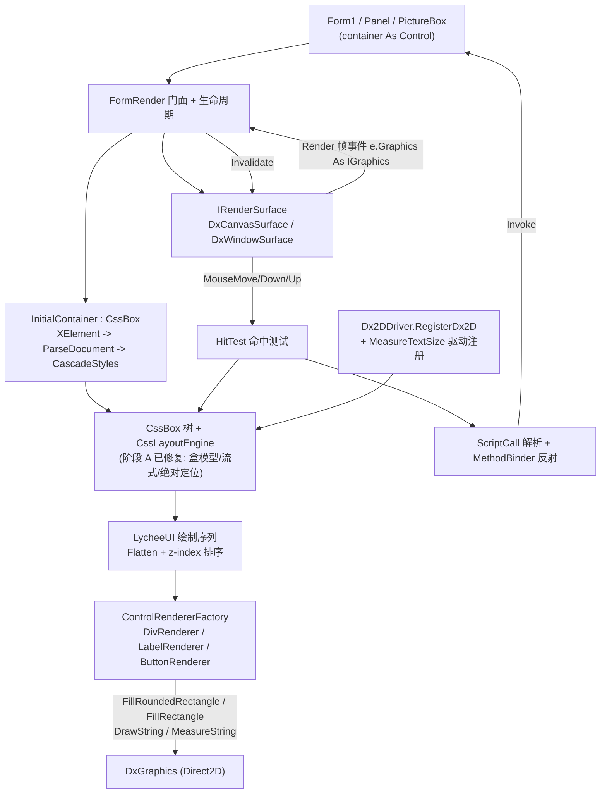

## 产品概述

分两个前后依赖的阶段交付：

**阶段 A**：把 `G:\GCModeller\src\runtime\sciBASIC#\mime\text%html\Render`（`Render\CSS` 目录为主）里被 `#If NET48` 冻结的 HTML/CSS 布局与样式计算代码修复为 net10.0 跨平台代码，绘图对象改用基础核心库自带的兼容层 `Microsoft.VisualBasic.Core\src\Drawing\netcore8.0\`（`Imaging.IGraphics / Font / FontFamily / Pen / Brush / GraphicsPath / Region / Bitmap`），并按需要补齐兼容层自身的缺口。

**阶段 B**：在 `g:\lychee\src\LycheeUI` 中**直接复用**阶段 A 修复好的 `InitialContainer` + `CssBox` + `CssLayoutEngine` 做布局与样式计算，用 DirectX（`DxCanvas`）把计算结果绘制到 WinForms 宿主控件上，并实现相对坐标的鼠标命中测试与 `onclick` 反射调用。

## 核心功能

- **声明式 UI**：宿主窗体以 VB XML 字面量（`XElement`）声明 `<form>` / `<div>` / `<label>` / `<button>` 及其 `style`、`onclick` 属性。
- **解冻的布局引擎**：`CssValue.ParseLength`（px/em/ex/mm/cm/in/pt/pc/%）、`CssBox` 盒模型（`ActualPadding*`/`ActualMargin*`/`ActualBorder*Width`/`ClientRectangle`/`ContainingBlock`/`MarginCollapse`）、`CssLayoutEngine`（`CreateLineBoxes`/`FlowBox`/`ApplyAlignment` 换行与 text-align）在 net10.0 下恢复可用。
- **DirectX 渲染**：`New FormRender(ui, container)` 后在 container（Form / Panel / PictureBox）上建立 GPU 画布并逐帧绘制；容器尺寸变化实时重算布局重绘。
- **宿主抽象**：渲染后端抽象为 `IRenderSurface`，首版「嵌入 DxCanvas 子控件」，预留「DxWindowCanvas 直绘 container 句柄」。
- **样式覆盖**：`background-color`、`color`、`width/height`、`left/top/right/bottom`（标准 CSS 绝对定位语义，% 相对父容器）、`padding`、`margin`、`border`、`border-radius`、`font-*`、`text-align`、`z-index`、`display`(block/inline)。
- **嵌套与流式**：div 嵌套布局；block 独占行向下、inline 同行向右超宽换行；绝对定位元素脱离流覆盖。
- **鼠标交互**：按 z 序做命中测试，提供 hover / pressed 视觉反馈；`MouseMove/MouseDown/MouseUp/MouseClick` 全程接管。
- **脚本绑定**：解析 `onclick="clickButton()"` 与 `onclick="click2('aa+bb+cc')"`，在 container 及其父链上按 `Public Or NonPublic` 反射查找方法、按参数个数与类型转换匹配重载并调用。

## 验收用例

`g:\lychee\test\Form1.vb` 现有声明必须跑通：灰底窗体、红色 button（左上角位于 50%/50%）、黄色 button（`right:0` 贴右）、hover 高亮、点击分别弹出 "Hello world!" 与 "aa+bb+cc"。引擎须容错两个 button 的重复 id 与 `button: 0` 拼写错误（未知属性忽略）。

## 技术栈

- **语言/框架**：VB.NET，`net10.0-windows`，WinForms，x64。
- **DirectX**：`G:\Microsoft.VisualBasic.Drawing\src\DXApi\DXApi.vbproj`（`DxGraphics`、`DxWindowCanvas`、`Dx2DDriver`，纯手写 P/Invoke COM，无 NuGet 包）与 `...\src\DxCanvas\DxCanvas.vbproj`（`DxCanvas : Inherits UserControl`，`Render As DxRenderEventArgs`）。
- **HTML/CSS 解析与布局**：`Microsoft.VisualBasic.MIME.Html`（`html_netcore5.vbproj`，`net10.0`）的 `Parser`、`CssParser`、`CssValue`、`CssLength`、`CssBox`、`CssLayoutEngine`、`InitialContainer`、`HtmlTag`。
- **GDI+ 兼容层**：`Microsoft.VisualBasic.Core\src\Drawing\netcore8.0\`（`Namespace Microsoft.VisualBasic.Imaging`：`Font`/`FontFamily`/`StringFormat`/`GraphicsUnit`/`FontStyle`、`Pen`/`Pens`/`DashStyle`、`Brush`/`SolidBrush`/`Brushes`/`LinearGradientBrush`、`Image`/`Bitmap`、`GraphicsPath`、`Region`、`Matrix`、`GraphicsOptions`）与 `Core\src\Drawing\GDI+\Interface.vb` 的 `IGraphics`。
- **绘图/颜色**：`Microsoft.VisualBasic.Imaging.GDIColors.TranslateColor`、`HexColor.HexToColor`、`GeomTransform.CenterAlign`、`DriverLoad.MeasureTextSize`。
- **引用现状**：`LycheeUI.vbproj` 已引用上述全部项目，**无需新增 ProjectReference**。

## 实施方案

### 总体策略

先做「地基」再做「引擎」：阶段 A 让被 `#If NET48` 冻结的 HtmlRenderer 计算代码在 net10.0 下真正编译并跑通（绘图类型统一换成兼容层 + `IGraphics`），阶段 B 只做「复用 + 绘制 + 交互」，**不自研布局**。

数据流：`XElement` → `InitialContainer.New(xml)`（`ParseDocument` → `CascadeStyles` → `BlockCorrection`）→ `SetBounds(viewport)` → `MeasureBounds(g)` → 读取每棵 `CssBox` 的 `Bounds`/`ClientRectangle`/`ActualBackgroundColor`/`ActualColor`/`ActualFont`/`ActualBorder*Width`/`ActualCornerNW..`/`TextAlign` → LycheeUI 绘制器按 z-index 排序在 `IGraphics` 上作画 → 鼠标事件把客户区坐标交给命中测试找到 `CssBox` → 读 `onclick` → `ScriptCall.Parse` → `MethodBinder.Invoke`。

### 关键技术决策（含取舍）

1. **`g As Graphics` → `g As IGraphics`，不去造一个 `Graphics` 影子类**
兼容层设计意图明确：`Pen`/`Brush`/`GraphicsPath`/`Region` 只是**参数记录器**，真正的绘制由 `IGraphics` 子类消费。强行补一个 `Graphics` 类型会与 `IGraphics` 重复且无处落地。Render 目录 41+ 处签名改为 `IGraphics` 即可，且 `IGraphics` 已提供 `MeasureString`/`DrawString`/`DrawRectangle`/`FillRectangle`/`DrawPath`/`FillPath`/`SetClip(RectangleF)`，覆盖全部调用点。

2. **字体度量：补兼容层而非改每个调用点**
`f.FontFamily.GetCellAscent/GetCellDescent/GetLineSpacing/GetEmHeight` 是 HTML 排版的通用货币（`CssBox.FontAscent/FontDescent/FontLineSpacing`、`CssLayoutEngine.GetAscent/GetDescent/GetLineSpacing`、`CssLineBox.GetBaseLineHeight`、`CssBox.NoEms` 的 em 换算）。补兼容层按 TrueType 设计栅格归一化实现，所有既有公式**一行不用改**，且 SVG/PostScript 等其它 `IGraphics` 后端也一并受益。
典型值：`unitsPerEm = 2048`、`ascent = 1854`、`descent = 434`、`lineGap = 67`（`lineSpacing = ascent + descent + lineGap = 2355`）。注意 `GetEmHeight` 当前硬编码 `Return 12`，会破坏 `f.Size * ascent / emHeight` 公式，必须一并改成 2048 并保持分子分母同栅格。

3. **`MeasureCharacterRanges` / `CharacterRange` / `StringFormat.SetMeasurableCharacterRanges` 不补，改调用点**
理由：这是 GDI+ 独有的"逐字符区间包围盒"API，兼容层全仓库 0 命中，模拟它需要真正的光栅化后端，与"跨平台纯计算"目标冲突。改为 `g.MeasureString(word, ActualFont)`：`CssBox.MeasureWordsSize` 拿 `SizeF` 作 `b.Width/b.Height`、`LastMeasureOffset` 退化为 `PointF.Empty`；`CssLayoutEngine.WhiteSpace` 改为 `g.MeasureString(" .", b.ActualFont).Width - g.MeasureString(".", b.ActualFont).Width`（失败时保留原 `onError = 5.0F` 兜底）。

4. **`GraphicsPath(PointF(), Byte())` + `PathPointType` 不补，改调用点**
兼容层 `GraphicsPath` 已提供 `AddLines(ParamArray points As PointF())` 与 `AddPath(path, connect)`，语义完全等价，改 `CssDrawingHelper.vb:198` 一行即可。

5. **`g.Clip` / `SetClip(Region, CombineMode)` 不补，改调用点**
`IGraphics` 只有 `RectangleF` 粒度的 Clip 且无 Save/Restore 状态栈。改为在 `HtmlRenderer.Render` 里用 `RectangleF` 保存/恢复：`If clip Then g.SetClip(area)` … `g.ResetClip()`。

6. **类型二义性统一用 Imports 别名消歧**
`CssBox.vb`、`CssLayoutEngine.vb`、`CssLineBox.vb`、`CssDrawingHelper.vb`、`CssTable.vb` 同时 `Imports System.Drawing` 与 `Imports Microsoft.VisualBasic.Imaging`，两者都定义 `Font`/`Pen`/`GraphicsPath`/`Region`/`Brush`。沿用 `Render\TextString.vb:70-80` 已验证的写法：`Imports Font = Microsoft.VisualBasic.Imaging.Font` 等。`Color`/`RectangleF`/`PointF`/`SizeF` 保持 `System.Drawing`（来自内置 `System.Drawing.Primitives`，跨平台可用）。

7. **`CssTable`（950 行）本期只解冻到"能编译 + 不破坏块布局"**
UI 引擎首版不需要表格。建议：`CssTable` 整体解冻但把表格专属算法（`ApplyCellVerticalAlignment`、列宽分配）保留为最小可用实现，`CssBox.MeasureBounds` 里 `Display = Table/InlineTable` 的分支照常调用；若实测风险过大，退而求其次——在 `CssBox` 中把 Table 分支降级为按 Block 处理，并把 `CssTable` 保留在 NET48 块内（此时 `Render\CSS` 其余类型可独立编译）。

8. **DirectX 必须注册文本度量驱动**
`Dx2DDriver.RegisterDx2D()` 只 `DriverLoad.Register(New DxDriver, Drivers.GDI)`，**没有注册 `Func(Of String, Font, SizeF)`**。`Font.GetHeight(g)` / `FontFace.MeasureString` 走 `DriverLoad.MeasureTextSize`，未注册会抛 `InvalidProgramException("missing text size measurement driver!")`。补一个懒初始化的离屏 `DxGraphics`（8×8）做 `MeasureString`，进程内单例、线程内缓存。

9. **圆角矩形走 DXApi 新增原生封装**
`D2D1` 原生声明已有 `DrawRoundedRectangle`/`FillRoundedRectangle`/`CreateRoundedRectangleGeometry`，只是 `DxGraphics` 未暴露。在 `DxGraphics.vb` 加两个薄封装；绘制器 `TryCast(g, DxGraphics)` 调用，拿不到则降级直角矩形——避免跨项目改动成为阻塞项。

### 性能与可靠性

- 布局结果缓存：画布 `Size` 未变且 hover/pressed 未变时跳过 `MeasureBounds`（`CssBox` 内部有 `_wordsSizeMeasured`、`Single.NaN` 惰性缓存，重入成本已很低，但仍应避免每帧全量重算）。
- 命中测试 O(n) 线性扫描（控件量级几十，无需空间索引），按 z-index 倒序提前命中即返回。
- `Font`/`Brush`/`Pen` 在样式解析结果中缓存复用（DirectX 侧 `DxBrushCache` 以 `Name|Size|Bold|Italic` 为 key 缓存 `IDWriteTextFormat`，重复 `New Font` 不会重建 GPU 资源）。
- hover 变化时才 `Invalidate()`；`MouseMove` 命中结果未变不重绘。
- `MethodInfo` 反射结果缓存（`Dictionary(Of String, MethodInfo)`），避免每次点击全量 `GetMethods`。
- 异常隔离：单元素绘制异常不中断整帧；反射调用失败写调试信息不崩溃。

### 实施注意事项（防回归）

- **类型边界（极易踩坑）**：`Color/Rectangle/RectangleF/Point/PointF/Size/SizeF` 用 `System.Drawing`；`Font/Pen/Brush/SolidBrush/Image/Bitmap/GraphicsPath` **必须**用 `Microsoft.VisualBasic.Imaging.*`。传 `System.Drawing.Font` 编译失败。
- **重绘用 `canvas.Invalidate()`**，不能用 `container.Invalidate()`——父窗口会把子窗口裁出自己的更新区。
- **STA**：DirectX + WinForms 必须 STA；确认 test 入口有 `<STAThreadAttribute>`。
- **构造时机**：`FormRender` 在 `Form1` 字段初始化器构造，此时句柄可能未创建——`Controls.Add` 安全，DxCanvas 设备在首次 `OnPaint` 才建立，无需等 `Load`。
- **`Option Strict` 默认 Off**：`TextString.vb:95 font = copy.font.Clone`（Clone 返回 Object）、`TextStringModel.vb:308 CTypeDynamic` 属晚期绑定，移植时不要顺手开 `Option Strict On`。
- **`FontFace.Shared Sub New`** 字体集合初始化被 `#If NET48` 包裹，net10 下 `fontFamilies` 为空 → `IsInstalled`/`GetFontName` 会炸，需补跨平台初始化（改为内置常量清单 + 容错默认 `SegoeUI`）。
- **`GenerateDocumentationFile=True`**：新增 Public 成员缺 XML 注释只告警不报错，但应保持注释完整。
- **无人值守冒烟不能弹 `MessageBox`**：用独立宿主窗体（方法改为写文件/控制台），不改 `Form1.vb` 交互行为。
- **`LycheeUI.vbproj` 的 `<StartupObject>LycheeUI.Form1</StartupObject>`** 对库项目无意义，编译报错时删除。

## 架构设计



## 目录结构

```
G:\GCModeller\src\runtime\sciBASIC#\Microsoft.VisualBasic.Core\src\Drawing\
├── netcore8.0\Font.vb                   # [MODIFY] FontFamily 度量实现（ascent/descent/lineSpacing/emHeight 按
│                                        #          2048 栅格归一化）；Font 增加 FontFamily 只读属性；修复 Height 恒 0。
├── GDI+\FontFace.vb                     # [MODIFY] Shared Sub New 的字体集合初始化去掉 #If NET48，改跨平台清单。
└── GDI+\Interface.vb                    # [MODIFY] 视需要补 IGraphics 的辅助方法（尽量不改，优先改调用点）。

G:\GCModeller\src\runtime\sciBASIC#\mime\text%html\
├── Render\CSS\CssValue.vb               # [MODIFY] 删除 #If NET48(99-188/313-335/436-477)，放出 ParseLength、
│                                        #          GetActualBorderWidth、GetImage；GetImage 改走 Imaging.Image。
├── Render\CSS\CssRectangle.vb           # [MODIFY] 校验（已可用）。
├── Render\CSS\CssLineBox.vb             # [MODIFY] 解冻；g As Graphics -> IGraphics；GetBaseLineHeight /
│                                        #          DrawRectangles / SetBaseLine 改用 Imaging 类型。
├── Render\CSS\CssBoxWord.vb             # [MODIFY] 解冻；Drawing.Image -> Imaging.Image；类型别名消歧。
├── Render\CSS\CssBoxWordSplitter.vb     # [MODIFY] 解冻。
├── Render\CSS\CssBlock.vb               # [MODIFY] 解冻。
├── Render\CSS\CssAnonymousBox.vb        # [MODIFY] 解冻。
├── Render\CSS\CssAnonymousBlockBox.vb   # [MODIFY] 解冻。
├── Render\CSS\CssBox.vb                 # [MODIFY] ★核心。解冻 105-3260；MeasureBounds/Paint/PaintBorder/
│                                        #          PaintBackground/PaintDecoration 的 g 改 IGraphics；
│                                        #          MeasureWordsSize 的 MeasureCharacterRanges 改 MeasureString；
│                                        #          ActualFont 的 Global.System.Drawing.FontStyle 改 Imaging.FontStyle。
├── Render\CSS\CssLayoutEngine.vb        # [MODIFY] 解冻；g 改 IGraphics；WhiteSpace 改 MeasureString 差分；
│                                        #          补全 ApplyLeftAlignment / vertical-align 空分支（可选）。
├── Render\CSS\CssDrawingHelper.vb       # [MODIFY] 解冻；GraphicsPath(pts, types) 改 AddLines；RoundP/RoundR 补实现。
├── Render\CSS\CssTable.vb               # [MODIFY] 解冻（最小可用）或保留 NET48 + CssBox 降级 Table 分支。
├── Render\HtmlTag.vb                    # [MODIFY] 解冻。
├── Render\InitialContainer.vb           # [MODIFY] 解冻；新增 Sub New(xml As XElement) 重载。
└── Render\HtmlRenderer.vb               # [MODIFY] 删除 106-144 的 #If NET48，放出两个 Render 扩展；g 改 IGraphics；
                                         #          g.Clip/SetClip(Region, CombineMode) 改 RectangleF + ResetClip。

G:\Microsoft.VisualBasic.Drawing\src\
├── DXApi\Dx2DDriver.vb                  # [MODIFY] RegisterDx2D 内补 DriverLoad.Register(Function(text, font) ...)，
│                                        #          用懒初始化离屏 DxGraphics 做 MeasureString。
└── DXApi\DxGraphics.vb                  # [MODIFY] 新增公开 FillRoundedRectangle / DrawRoundedRectangle 重载。

g:\lychee\src\LycheeUI\
├── FormRender.vb                        # [MODIFY] 门面：串起宿主/布局/绘制/事件；实现 IDisposable；暴露
│                                        #          Public Event OnClick；调试用 GetBounds/HitTest/SimulateClick。
├── LycheeUI.vbproj                      # [MODIFY] 视编译情况移除 <StartupObject>。
├── Layout\
│   ├── UiLayoutEngine.vb                # [NEW] 复用 InitialContainer：Build(xml) / Relayout(viewport, g) /
│   │                                    #          Flatten() 按 z-index + 文档序稳定排序输出绘制序列。
│   └── UiBox.vb                         # [NEW] CssBox 的轻量视图：Bounds / 背景色 / 前景色 / 字体 / 边框 /
│                                        #          圆角 / text-align / z-index / onclick / hover / pressed。
├── Render\
│   ├── IRenderSurface.vb                # [NEW] 渲染宿主抽象：Attach(container)/Invalidate()/Size/Handle/
│   │                                    #          Event Frame/PointerDown/PointerMove/PointerUp；继承 IDisposable。
│   ├── RenderFrameEventArgs.vb          # [NEW] Graphics As IGraphics、Size/Width/Height。
│   ├── PointerEventArgs.vb              # [NEW] X/Y（客户区像素）、Button As MouseButtons。
│   ├── DxCanvasSurface.vb               # [NEW] 首选后端：New DxCanvas With {.Dock=Fill}，container.Controls.Add；
│   │                                    #          转发 Render 为 Frame；转发继承来的鼠标事件。
│   └── DxWindowSurface.vb               # [NEW] 备选后端骨架：DxWindowCanvas(container.Handle, w, h) +
│                                        #          NativeWindow 子类化拦截 WM_ERASEBKGND/WM_PAINT。
├── Controls\
│   ├── IControlRenderer.vb              # [NEW] Interface IControlRenderer：Sub Render(g As IGraphics, box As UiBox)。
│   ├── DivRenderer.vb                   # [NEW] 背景（含圆角）+ 边框。
│   ├── LabelRenderer.vb                 # [NEW] 文本 + text-align + 换行。
│   ├── ButtonRenderer.vb                # [NEW] 背景（圆角）+ 边框 + 对齐文本 + hover/pressed 态。
│   └── ControlRendererFactory.vb        # [NEW] 标签名 -> 渲染器映射；未注册回退 DivRenderer。
└── Event\
    ├── HitTest.vb                       # [NEW] 按 z 序倒序，Bounds.Contains 首个命中。
    ├── ScriptCall.vb                    # [NEW] onclick 表达式 -> 方法名 + 参数字面量数组（去引号）。
    └── MethodBinder.vb                  # [NEW] container 及 Parent 链反射查找（Instance Or Public Or NonPublic），
                                         #          按参数个数+可转换类型匹配，缓存 MethodInfo。

g:\lychee\test\
├── Form1.vb                             # [MODIFY] 修正 button:0 -> bottom:0、重复 id -> hello/hello2（引擎仍需容错）。
└── Smoke.vb                             # [NEW] --smoke 无人值守冒烟：STA 建窗 + 布局断言 + 模拟点击 + 截图 + 退出码。
```

## 关键代码结构

```
' ---------- 阶段 A1：兼容层补全（Core\src\Drawing\netcore8.0\Font.vb） ----------
' TrueType 设计栅格归一化，使 f.Size * ascent / emHeight 公式成立
Public Class FontFamily
    Friend Const UnitsPerEm As Integer = 2048
    Friend Const TypoAscender As Integer = 1854
    Friend Const TypoDescender As Integer = 434     ' 取正值
    Friend Const TypoLineGap As Integer = 67

    Public Property Name As String

    Public Function GetEmHeight(fontStyle As FontStyle) As Integer : Return UnitsPerEm
    Public Function GetCellAscent(fontStyle As FontStyle) As Integer : Return TypoAscender
    Public Function GetCellDescent(fontStyle As FontStyle) As Integer : Return TypoDescender
    Public Function GetLineSpacing(fontStyle As FontStyle) As Integer
        Return TypoAscender + TypoDescender + TypoLineGap
    End Function
End Class

Public Class Font
    Public ReadOnly Property FontFamily As FontFamily     ' ★ 新增：既有代码大量使用 f.FontFamily
    Public ReadOnly Property Height As Single             ' ★ 修复恒 0：改为 Size * GetLineSpacing / GetEmHeight
End Class
```

```
' ---------- 阶段 A2：调用点改写（Render\CSS\CssBox.vb MeasureWordsSize） ----------
' 原：CharacterRange + StringFormat.SetMeasurableCharacterRanges + g.MeasureCharacterRanges
' 改：
Friend Sub MeasureWordsSize(g As IGraphics)
    ...
    Dim s As SizeF = g.MeasureString(word, ActualFont)   ' Imaging.Font
    b.LastMeasureOffset = PointF.Empty                   ' GDI+ 专属 API，退化为 (0,0)
    b.Width = s.Width
    b.Height = s.Height
End Sub

' ---------- Render\CSS\CssLayoutEngine.vb WhiteSpace ----------
Public Shared Function WhiteSpace(g As IGraphics, b As CssBox) As Single
    Dim w As Single = g.MeasureString(" .", b.ActualFont).Width - g.MeasureString(".", b.ActualFont).Width
    Return If(w <= 0, 5.0F, w)                           ' 兜底沿用原 onError = 5.0F
End Function

' ---------- Render\CSS\CssDrawingHelper.vb:198 ----------
Dim path As New GraphicsPath()
Call path.AddLines(pts)                                  ' 替代 New GraphicsPath(pts, Byte()) + PathPointType

' ---------- Render\HtmlRenderer.vb Render ----------
<Extension>
Public Sub Render(g As IGraphics, html As String, area As RectangleF, clip As Boolean)
    Dim container As New InitialContainer(html)
    If clip Then g.SetClip(area)
    Call container.SetBounds(area)
    Call container.MeasureBounds(g)
    Call container.Paint(g)
    If clip Then g.ResetClip()                           ' 替代 g.SetClip(prevClip, CombineMode.Replace)
End Sub
```

```
' ---------- 阶段 A3：InitialContainer XElement 入口 ----------
Public Sub New(xml As XElement)
    Me.New(xml.ToString())
End Sub
```

```
' ---------- 阶段 B：渲染宿主抽象 ----------
Public Interface IRenderSurface
    Inherits IDisposable
    ReadOnly Property Size As Size
    ReadOnly Property Handle As IntPtr
    Event Frame As EventHandler(Of RenderFrameEventArgs)
    Event PointerDown As EventHandler(Of PointerEventArgs)
    Event PointerMove As EventHandler(Of PointerEventArgs)
    Event PointerUp As EventHandler(Of PointerEventArgs)
    Sub Attach(container As System.Windows.Forms.Control)
    Sub Invalidate()
End Interface
```

```
' ---------- 阶段 B：DirectX 文本度量驱动（DXApi\Dx2DDriver.vb） ----------
Public Sub RegisterDx2D()
    Call DriverLoad.Register(New DxDriver, Drivers.GDI)
    Call DriverLoad.Register(Function(text As String, font As Imaging.Font) As SizeF
                                 Return Measurer.Current.MeasureString(text, font)
                             End Function)
End Sub
' Measurer：懒初始化单例离屏 DxGraphics(8, 8, "#ffffff")，只做 MeasureString
```

## 执行顺序与验证

| 步骤 | 产出 | 验证命令 |
| --- | --- | --- |
| A1 兼容层补全 | `FontFamily` 度量可用、`Font.FontFamily`/`Height` 可用、`FontFace` 不再炸 | `dotnet build G:\GCModeller\src\runtime\sciBASIC#\Microsoft.VisualBasic.Core\src\Core.vbproj` |
| A2 CssValue 解冻 | `ParseLength`/`GetActualBorderWidth`/`GetImage` 可用 | 同上 + html 项目 |
| A3~A5 CssBox/CssLayoutEngine/CssDrawingHelper/CssTable | 盒模型与流式布局在 net10 下可编译 | `dotnet build G:\GCModeller\src\runtime\sciBASIC#\mime\text%html\html_netcore5.vbproj` |
| A6 HtmlTag/InitialContainer/HtmlRenderer + XElement 重载 | 端到端 `Render` 可用 | 同上 |
| B1 DXApi 度量驱动 + 圆角封装 | `Font.GetHeight(g)` 不再抛 `InvalidProgramException` | `dotnet build G:\Microsoft.VisualBasic.Drawing\src\DXApi\DXApi.vbproj` |
| B2~B5 LycheeUI 布局适配/宿主/绘制/事件 | `FormRender` 闭环 | `dotnet build g:\lychee\src\LycheeUI\LycheeUI.vbproj` |
| B6 冒烟 | 无人值守断言通过 | `dotnet build g:\lychee\test\test.vbproj -c Debug` 后 `test.exe --smoke` |


**无人值守冒烟设计**：STA 线程内建独立宿主窗体（方法改为写文件/控制台，不弹 `MessageBox`）→ Show → `DoEvents` 若干帧 → 断言两个 button 的 `Bounds`（第一个左上角 ≈ (400, 225) 尺寸 200×60；第二个贴右）→ `SimulateClick` 验证反射调用命中 → `SaveImage` 输出 `smoke.png` → 以退出码 0/1 表达结果。

**人工验收**：直接运行 test 项目打开 `Form1`，确认灰底窗体、红色 button（左上角 50%/50%）、黄色 button（贴右下）、hover 高亮、点击分别弹出 "Hello world!" 与 "aa+bb+cc"。

## Agent Extensions

### SubAgent

- **code-explorer**
- 用途：阶段 A 逐文件解冻 `Render\CSS`（`CssBox.vb` 3261 行、`CssTable.vb` 950 行、`CssLayoutEngine.vb`）前，精确定位 `#If NET48` 边界、`Graphics`/`Font.FontFamily`/`MeasureCharacterRanges`/`GraphicsPath(pts, types)`/`PathPointType`/`g.Clip` 的每一处调用点与行号；阶段 B 动 `DXApi\DxGraphics.vb`（新增圆角封装）前复核 `renderTarget`/`brushes`/`D2D1_ROUNDED_RECT` 的既有实现风格。
- 预期结果：拿到与现有实现风格一致、可直接粘贴的 VB 代码片段，每个解冻文件一次编译通过，不凭记忆写错 API。