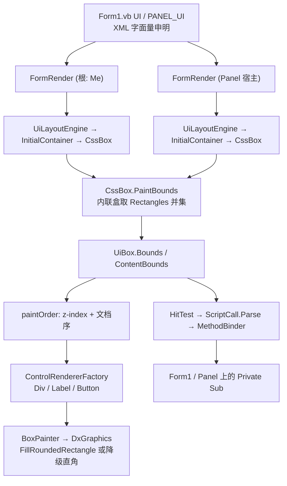

## 产品概述

扩充 `g:\lychee\test\Form1.vb` 的 UI 申明，把 LycheeUI 引擎已解冻的 HTML/CSS 能力全部覆盖到一份测试用例里：div 容器与嵌套布局、label/span/p 文本元素、padding/margin/border/圆角等盒模型样式、z-index 重叠绘制，以及全部参数形式的 `onclick` 反射调用；同时在 `Form1` 上开辟一个 `Panel` 子区域，用第二个 `FormRender` 实例验证「宿主容器不是 Form」的渲染场景。

## 核心功能

- **div 容器 + 嵌套布局**：左上区域一个带 `background-color` / `border` 简写 / 圆角 / `padding` 的 `<div>`，内部嵌套 `<label>` 与 `<button>`，子元素按相对父容器的偏移定位。
- **文本元素**：`<label>` 以 `display:block` 呈现 `text-align` 三态（left / center / right）并施加 `font-size` / `font-weight` / `font-style` / `font-family`；`<p>` 放长文本验证自动换行，其中嵌入 `<span>` 验证内联元素。
- **盒模型样式**：一个带 `margin` / `padding` / `border` / 圆角的按钮，验证 `ActualMargin*` / `ActualPadding*` / `ActualBorder*` / `Corner*` 计算与 DirectX 圆角绘制。
- **z-index 重叠绘制**：两个互相重叠的绝对定位 `<div>`，分别声明 `z-index:1` 与 `z-index:2`，验证绘制序列排序（后者盖住前者）。
- **事件绑定全覆盖**：新增宿主 `Private Sub` 覆盖无参、单字符串参（含逗号/括号特殊字符）、数字参（`Integer`）、双参数重载，验证 `ScriptCall` 的引号感知解析与 `MethodBinder` 的 `Convert.ChangeType` 转换。
- **Panel 宿主**：`Form1` 上放置一个 `Panel`，第二个 `FormRender` 把一份独立的 `PANEL_UI` 申明渲染到该 Panel 内。
- **冒烟同步**：`Smoke.vb` 扩充断言（嵌套定位、内联 `PaintBounds` 非 0、z-index 顺序、圆角盒、各类参数调用），保持无人值守与退出码 0/1。

## 必须先修的两个阻塞缺陷

1. **容器元素重复绘制子元素文本**：`UiBox.CollectText` 递归聚合所有后代文本，实测根 `<form>` 把两个 button 的文本拼成 "hellohello" 又画了一遍（`lychee-smoke.png` 的 `(5,220)` 采到近黑像素 `(29,0,29)`）。
2. **内联元素 `Bounds` 恒为 0x0**：内联盒的几何只存在于宿主行盒的 `Rectangles` 字典（`Friend`，外部不可访问），导致 `<label>` / `<span>` 不显式 `display:block` 时完全不可见、也不可命中。

## 技术栈

- VB.NET / `net10.0-windows` / WinForms / x64；`LycheeUI.vbproj` 已引用全部依赖，无需新增 ProjectReference。
- 布局与样式：`Microsoft.VisualBasic.MIME.Html.Render.InitialContainer` + `CssBox` + `CssLayoutEngine`（上一轮已从 `#If NET48` 解冻为跨平台代码）。
- 绘制：`Microsoft.VisualBasic.Drawing.DirectX.DxCanvas` / `DxGraphics`，经 `Microsoft.VisualBasic.Imaging.IGraphics` 抽象。
- 兼容层：`Microsoft.VisualBasic.Core\src\Drawing\netcore8.0\`（`Font `/ `FontFamily` / `Brush` / `Pen`）。

## 实施方案

### 关键决策与权衡

1. **先修缺陷再写用例**：内联元素与容器文本是新增 `<label>` / `<span>` / `<div>` 能否渲染出来的前置条件，不修则新元素不可见、命中测试也失效，测试无法验证任何东西。
2. **`PaintBounds` 放在 `CssBox` 而不是 LycheeUI**：`Rectangles` 是 `Friend`，只有 `CssBox` 自身能访问；对外暴露一个只读的 `PaintBounds` 是最小的公开面，且不改动既有布局算法。
3. **文本聚合遇到真实元素即停**：只聚合盒自身的 `Text` 与匿名文本盒（`HtmlTag Is Nothing`）的文本。这样 `<form>` 得到 `""`，`<button>` 仍得到 `"hello"`，既消除重复绘制，又保留「元素文本来自匿名子盒」的既有工作方式。
4. **`border-radius` 做成别名而非重命名**：`corner-radius` 是既有 `CssProperty` 名，直接改名会破坏历史申明；新增一个 `<CssProperty("border-radius")>` 属性转调 `CornerRadius`，两种写法都可用。
5. **`ApplyViewport` 强制根元素 `display:block`**：`CssDefaults` 的 block 列表不含自定义标签名，根元素若不是 block 则 `MeasureBounds` 的块级分支不处理、整个页面塌成 0 高。
6. **Panel 必须 `BringToFront()`**：WinForms `Controls` 索引 0 为最前层，根 `FormRender` 的画布 `Dock=Fill` 先加入即在最前，后加入的 Panel 会被完全遮住。

### 性能与可靠性

- 布局仍走 `InitialContainer.MeasureBounds` 的既有惰性缓存（`Single.NaN` + `_wordsSizeMeasured`），每帧只在 `hover`/`pressed` 变化时才 `Invalidate()`。
- `PaintBounds` 对内联盒做 `Rectangles` 并集，元素量级为几十，开销可忽略；需跳过 `Single.IsInfinity` 的无效矩形（既有 `CssLineBox.DrawRectangles` 已有同样判断）。
- 单元素绘制异常隔离不中断整帧（已在 `FormRender.handleFrame` 实现）；反射失败写 `LastError` 不崩溃。
- `MethodInfo` 按 `方法名/参数个数` 缓存，避免每次点击全量 `GetMethods`。

### 实施注意事项（防回归）

- **CSS 属性名按本引擎既有实现写**：圆角可写 `corner-radius` 或新增的 `border-radius`；`border`、`margin`、`padding` 简写已支持并自动展开；逐边属性为 `border-*-width/style/color`、`margin-*`、`padding-*`、`corner-nw/ne/se/sw-radius`。
- **类型边界**：`Color/RectangleF/PointF/SizeF` 用 `System.Drawing`；`Font/Pen/Brush/SolidBrush` 必须用 `Microsoft.VisualBasic.Imaging.*`，LycheeUI 侧需 `Imports Font = Microsoft.VisualBasic.Imaging.Font` 等别名消歧（net10.0-windows 下 `System.Drawing.Font` 也存在，不别名会二义性报错）。
- **重绘只能用 `canvas.Invalidate()`**，`container.Invalidate()` 无效（父窗会把子窗裁出更新区）。
- **匿名文本盒判定**：`UiLayoutEngine.GetView` 目前以 `HtmlTag Is Nothing` 或 `TagName` 为空判定并标为 `text`；修复 `CollectText` 时采用同一判据，若发现 `CssAnonymousBox` 自带 `HtmlTag`，则退化为「`HtmlTag Is Nothing OrElse HtmlTag.TagName` 为空」。
- **冒烟不得弹 `MessageBox`**：宿主方法改为写 `Clicks` 列表；`Form1.vb` 的交互行为（弹窗）保持不变。

## 架构设计



## 目录结构

```
G:\GCModeller\src\runtime\sciBASIC#\mime\text%html\Render\CSS\
└── CssBox.vb                             # [MODIFY] 新增 Public ReadOnly Property PaintBounds As RectangleF
                                          #          （内联盒取 Rectangles 并集，其余取 Bounds）；
                                          #          新增 <CssProperty("border-radius")> Public Property BorderRadius（转调 CornerRadius）

g:\lychee\src\LycheeUI\
├── Layout\UiBox.vb                       # [MODIFY] Bounds/ContentBounds 改用 Source.PaintBounds；
│                                         #          walkText 遇到 HtmlTag 非空的子盒不再下钻（消除容器重复绘制文本）
└── Layout\UiLayoutEngine.vb              # [MODIFY] ApplyViewport 追加 page.Display = CssConstants.Block

g:\lychee\test\
├── Form1.vb                              # [MODIFY] ★主交付。UI 申明扩充（div 嵌套 / label / p+span / 盒模型 button /
│                                         #          z-index 重叠 / 四类 onclick）；新增 Panel 字段与 PANEL_UI 申明、
│                                         #          第二个 FormRender；新增宿主 Private Sub
└── Smoke.vb                              # [MODIFY] SmokeHost 的 UI 同步扩充；新增断言：嵌套定位、内联 PaintBounds 非 0、
                                          #          z-index 绘制顺序、圆角盒、数字/多参/特殊字符调用、根元素文本为空
```

## 关键代码结构

```
' ---------- CssBox.vb：内联盒的绘制矩形 ----------
''' <summary>
''' The rectangle that should be used to paint this box: an inline box does
''' not own a location or a size of its own, its geometry is described by the
''' line boxes that host it, so the union of these rectangles is returned at
''' here, while a block box simply returns its own bounds.
''' </summary>
Public ReadOnly Property PaintBounds As RectangleF
    Get
        If Rectangles IsNot Nothing AndAlso Rectangles.Count > 0 Then
            Dim l As Single = Single.MaxValue, t As Single = Single.MaxValue
            Dim r As Single = Single.MinValue, b As Single = Single.MinValue

            For Each rect As RectangleF In Rectangles.Values
                If Single.IsInfinity(rect.Width) OrElse Single.IsInfinity(rect.Height) Then
                    Continue For
                End If
                If rect.Left < l Then l = rect.Left
                If rect.Top < t Then t = rect.Top
                If rect.Right > r Then r = rect.Right
                If rect.Bottom > b Then b = rect.Bottom
            Next

            If l <= r AndAlso t <= b Then
                Return RectangleF.FromLTRB(l, t, r, b)
            End If
        End If

        Return Bounds
    End Get
End Property

''' <summary>the ``border-radius`` alias of the ``corner-radius`` property</summary>
<CssProperty("border-radius")>
<DefaultValue("0")>
Public Property BorderRadius As String
    Get
        Return CornerRadius
    End Get
    Set
        CornerRadius = Value
    End Set
End Property
```

```
' ---------- UiBox.vb：文本不再穿透真实元素 ----------
Private Shared Sub walkText(box As CssBox, text As StringBuilder)
    If box Is Nothing Then Return
    If Not String.IsNullOrEmpty(box.Text) Then Call text.Append(box.Text)
    If box.Boxes Is Nothing Then Return

    For Each child As CssBox In box.Boxes
        ' a box that owns an html tag is a real element of the declaration:
        ' its text belongs to the element itself and must not be painted again
        ' by the container of it
        If child.HtmlTag IsNot Nothing Then Continue For
        Call walkText(child, text)
    Next
End Sub

Public ReadOnly Property Bounds As RectangleF
    Get
        Return Source.PaintBounds
    End Get
End Property
```

```
' ---------- UiLayoutEngine.vb：根元素强制块级 ----------
page.Display = CssConstants.Block
```

```
' ---------- Form1.vb：Panel 宿主的挂载顺序（关键） ----------
' 根 FormRender 的画布 Dock=Fill 先加入 Controls（索引 0 = 最前层），
' 因此后加入的 Panel 必须 BringToFront，否则会被根画布完全遮住。
Private Sub Form1_Load(sender As Object, e As EventArgs) Handles MyBase.Load
    Me.Controls.Add(panel)
    Call panel.BringToFront()

    panelUi = New FormRender(PANEL_UI, panel)
End Sub
```

### Form1.vb 扩充后的 UI 申明草稿（800x450 分区）

| 区域 | 内容 |
| --- | --- |
| 左上 `x16..336, y16..196` | `<div>` 容器（背景+border 简写+圆角+padding），内嵌 `<label>` 与 `<button onclick="nested('from div')">` |
| 右上 `x370..570` | z-index 重叠：`<div z-index:1>` 与 `<div z-index:2>` 部分重叠 |
| 右上 `x580..780, y20..140` | **Panel 宿主区域**（WinForms 控件，非申明） |
| 左侧 `y210..300` | 三个 `display:block` 的 `<label>`，text-align 分别 left / center / right，配字体样式 |
| 左侧 `y310..370` | `<p>` 长文本（自动换行），内嵌 `<span>` 内联元素 |
| 中 `x400..600, y225..285` | 原有红色 `<button onclick="clickButton()">`（保持不变） |
| 中下 `x500..660, y300..356` | 带 margin / padding / border / 圆角的 `<button>` |
| 左下 `y380..440` | 三个小 button：`onCount(42)` 数字参、`onMulti('items', 7)` 多参、`onSpecial('a, b (c)')` 特殊字符 |
| 右下 `[600,390]` | 原有黄色 `<button onclick="click2('aa+bb+cc')">`（保持不变） |


宿主方法清单（全部 `Private Sub`，验证 `NonPublic` 反射查找）：
`clickButton()`、`click2(text As String)`、`nested(text As String)`、`onCount(n As Integer)`、`onMulti(name As String, count As Integer)`、`onSpecial(text As String)`、`panelClick(text As String)`。

## 验证方式

1. `dotnet build G:\GCModeller\src\runtime\sciBASIC#\mime\text%html\html_netcore5.vbproj -c Debug` —— `PaintBounds` / `BorderRadius` 改动。
2. `dotnet build g:\lychee\test\test.vbproj -c Debug` —— 0 错 0 警。
3. `test.exe --smoke` —— 退出码 0，`Boxes` 输出中 z=2 元素排在 z=1 之后、内联元素 `PaintBounds` 非 0、圆角盒 `IsRounded=True`、四类参数调用全部命中。
4. PowerShell + `System.Drawing` 采样 `lychee-smoke.png`：背景仍为 `(128,128,128)`；原重复绘制区域不再有近黑残留；新增 div/label 区域出现预期颜色；z=2 元素在重叠区覆盖 z=1。
5. 人工运行 test 项目打开 `Form1`，确认 div 容器与嵌套控件、文本对齐三态、圆角按钮、z-index 覆盖、Panel 内独立界面，点击各类按钮弹出对应内容。

## Agent Extensions

### SubAgent

- **code-explorer**
- 用途：动手改 `CssBox.vb` 前，确认 `CssAnonymousBox` / `CssAnonymousSpaceBox` 构造时是否会设置 `HtmlTag`（决定 `CollectText` 的匿名盒判据是「`HtmlTag Is Nothing`」还是还要加「`TagName` 为空」），并复核 `Rectangles` 字典的确切声明位置与 `CssConstants.Block` 常量名。
- 预期结果：拿到可直接粘贴的判据与属性名，避免内联元素仍被判为真实元素、或块级常量写错导致编译失败。