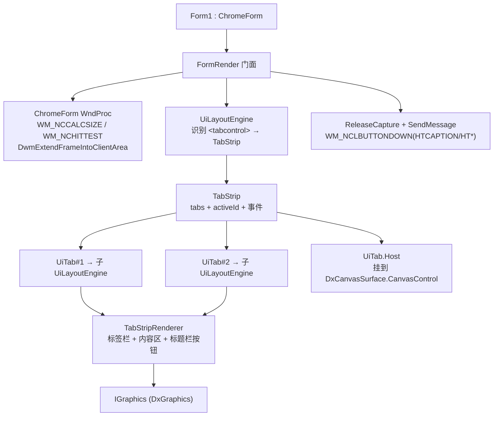

## 产品概述

在 `g:\lychee\src\LycheeUI` 中实现一个仿浏览器多标签页的可复用 UI 组件，并配套提供具备自定义标题栏能力的窗体基类。整体布局为三段式：顶部标题栏（窗体图标 + 标签页 + “+”新建按钮 + 最小化/最大化/关闭三按钮）、标签栏、内容区域（随标签切换）。

## 对用户问题的直接回答

**不需要**把 `FormBorderStyle` 设为 `None`。纯 `None` 会一次性丢掉 DWM 真实窗口阴影、系统缩放边框、Aero Snap 贴边分屏和系统最小化/还原动画，这些全部要自己补，成本高且效果打折。

正确做法是：**保留 `FormBorderStyle=Sizable`，通过 `WM_NCCALCSIZE`（`wParam != 0` 时返回 0）抹掉可视边框但保留非客户区**。这样 DWM 阴影、缩放、Snap、系统动画全部免费保留；拖拽与缩放用 `ReleaseCapture() + SendMessage(hWnd, WM_NCLBUTTONDOWN, HTCAPTION/HTLEFT/..., 0)` 从子控件直接触发，因此**无需修改 DxCanvas**（不必让子控件返回 HTTRANSPARENT），集成成本最低。

## 核心功能

- **标签栏**：每标签 = favicon + 标题 + 关闭按钮（仅 hover 或激活时显示 ×）；栏末尾 “+” 新建按钮；激活标签背景与内容区一致（视觉连体、无下边框），非激活深色、hover 变亮；标签宽度按内容收缩（下限 60px），超出可横向滚动（滚轮 + 拖到边缘）。
- **内容区域**：每个页签对应独立内容，激活时由独立子引擎布局绘制；支持把已有 WinForms 控件挂进页签内容区（切页时只显示激活页的 Host）。
- **交互**：点击标签激活；点击 × 关闭（关闭激活页自动切右侧、无则左侧；关闭最后一个显示空白欢迎页）；点击 + 新建并激活；支持拖拽排序；双击标题栏切换最大化；标题栏空白区拖拽移动窗口、边缘拖拽缩放。
- **双形态 API**：声明式 `<tabcontrol><page title=... favicon=...>...</page></tabcontrol>` + 编程式 `NewTab/CloseTab/Activate/MoveTab` 与 `TabCreated/TabActivated/TabClosed` 事件，共用同一份状态。
- **窗体 Chrome**：`ChromeForm` 基类（继承 Form），提供 `WM_NCCALCSIZE`/`WM_NCHITTEST` 处理、`DwmExtendFrameIntoClientArea` 阴影兜底、`CaptionRegion` 可拖拽区域与三个标题栏按钮。

## 技术方案

### 技术栈

- VB.NET / `net10.0-windows` / WinForms / x64；`LycheeUI.vbproj` 已引用全部依赖，无需新增 ProjectReference。
- Win32 互操作：`ReleaseCapture` / `SendMessage` / `GetSystemMetrics` / `DwmExtendFrameIntoClientArea`（无第三方包）。
- 布局复用 `InitialContainer` + `CssBox`；绘制经 `Microsoft.VisualBasic.Imaging.IGraphics`（DirectX 后端 `DxGraphics`）。

### 架构设计



### 关键决策与取舍

1. **不用 `FormBorderStyle=None`**（回答用户问题）：保留 Sizable 边框 + `WM_NCCALCSIZE` 抹掉可视边框，DWM 阴影/缩放/Snap/动画免费保留。
2. **拖拽缩放用 `ReleaseCapture + SendMessage(WM_NCLBUTTONDOWN, HT*)` 而非改 DxCanvas**：子控件在自己 WndProc 里向窗体句柄发 `WM_NCLBUTTONDOWN` 即可，完全绕开“子控件挡住窗体命中测试”的问题，无需跨项目改 DxCanvas。
3. **每页签一份独立 `UiLayoutEngine` 子引擎**：切页后 input 文本、checkbox 状态等天然保留（views 字典随引擎实例存活）；激活页才参与 `Relayout`，非激活页零开销。
4. **TabStrip 状态与渲染分离**：`TabStrip`（状态 + 事件）与 `TabStripRenderer`（纯绘制 + 命中计算）分开，声明式与编程式共用同一份状态。
5. **声明式与编程式共用状态**：`<tabcontrol>` 元素在 `walk` 中被识别并排除出普通渲染序列，由 `FormRender` 在帧末统一绘制；编程式 API 直接操作同一个 `TabStrip` 实例。
6. **WinForms 控件挂载**：`UiTab.Host` 的控件 `Add` 到 `DxCanvasSurface.CanvasControl.Controls`，按内容区矩形设 `Bounds` 并 `BringToFront()`；切页时只显示激活页的 Host。

### 性能与可靠性

- 非激活页签内容不参与布局计算；`MeasureTabs` 每帧只做 O(n) 矩形累加。
- favicon 复用 `UiImages` 进程级缓存，加载失败画首字母圆底占位且只记录一次。
- Win32 调用全部包 Try/Catch；`Timer` 沿用 Try/Catch + Stop 模式；`Dispose` 释放 Timer 与解绑事件。

### 关键代码结构

```
' Chrome\NativeMethods.vb —— 全部 Friend
Friend Const WM_NCCALCSIZE As Integer = &H83
Friend Const WM_NCHITTEST As Integer = &H84
Friend Const WM_NCLBUTTONDOWN As Integer = &HA1
Friend Const HTCLIENT As Integer = 1, HTCAPTION As Integer = 2
Friend Const HTLEFT = 10, HTRIGHT = 11, HTTOP = 12, HTTOPLEFT = 13,
             HTTOPRIGHT = 14, HTBOTTOM = 15, HTBOTTOMLEFT = 16, HTBOTTOMRIGHT = 17
Friend Const SM_CXFRAME = 32, SM_CYFRAME = 33, SM_CXPADDEDBORDER = 92

<DllImport("user32.dll")> Friend Function ReleaseCapture() As Boolean
<DllImport("user32.dll")> Friend Function SendMessage(hWnd As IntPtr, msg As Integer,
        wParam As IntPtr, lParam As IntPtr) As IntPtr
<DllImport("user32.dll")> Friend Function GetSystemMetrics(nIndex As Integer) As Integer
<DllImport("dwmapi.dll")> Friend Function DwmExtendFrameIntoClientArea(hWnd As IntPtr,
        ByRef margins As MARGINS) As Integer

<StructLayout(LayoutKind.Sequential)> Friend Structure MARGINS
    Public Left, Right, Top, Bottom As Integer
End Structure

' Chrome\ChromeForm.vb —— 核心窗口消息处理
Protected Overrides Sub WndProc(ByRef m As Message)
    Select Case m.Msg
        Case WM_NCCALCSIZE
            If m.WParam.ToInt32() <> 0 Then
                If Me.WindowState = FormWindowState.Maximized Then
                    ' 最大化时内容会超出屏幕，需要向内收缩一个可缩放边框宽度
                    Dim frame As Integer = GetSystemMetrics(SM_CXFRAME) + GetSystemMetrics(SM_CXPADDEDBORDER)
                    Dim params As NCCALCSIZE_PARAMS =
                        Runtime.InteropServices.Marshal.PtrToStructure(m.LParam, GetType(NCCALCSIZE_PARAMS))
                    params.rgrc0.Left += frame : params.rgrc0.Top += frame
                    params.rgrc0.Right -= frame : params.rgrc0.Bottom -= frame
                    Runtime.InteropServices.Marshal.StructureToPtr(params, m.LParam, False)
                End If
                m.Result = IntPtr.Zero      ' 抹掉可视边框，保留非客户区
                Return
            End If

        Case WM_NCHITTEST
            Call MyBase.WndProc(m)
            If m.Result.ToInt32() = HTCLIENT Then
                Dim p As Point = Me.PointToClient(New Point(m.LParam.ToInt32()))
                Dim hit As Integer = HitTestChrome(p)    ' CaptionRegion→HTCAPTION，边缘→HT*
                If hit <> HTCLIENT Then m.Result = New IntPtr(hit)
            End If
            Return
    End Select
    Call MyBase.WndProc(m)
End Sub

' FormRender —— 从子控件触发拖拽与缩放（无需改 DxCanvas）
Friend Shared Sub DragWindow(form As Form)
    Call NativeMethods.ReleaseCapture()
    Call NativeMethods.SendMessage(form.Handle, NativeMethods.WM_NCLBUTTONDOWN,
                                   NativeMethods.HTCAPTION, IntPtr.Zero)
End Sub

Friend Shared Sub ResizeWindow(form As Form, hit As Integer)
    Call NativeMethods.ReleaseCapture()
    Call NativeMethods.SendMessage(form.Handle, NativeMethods.WM_NCLBUTTONDOWN,
                                   New IntPtr(hit), IntPtr.Zero)
End Sub

' Tabs\TabStripRenderer.vb —— 拖拽排序状态机
' Idle → (MouseDown on Tab) Pressing(index) → (|dx| > 6) Dragging(index)
'   → (mouse moves) 计算目标索引 → strip.MoveTab(id, target) → (MouseUp) Idle
```

### 实施顺序与验证

| 步骤 | 产出 | 验证命令 |
| --- | --- | --- |
| 1 | NativeMethods + ChromeForm | `dotnet build g:\lychee\src\LycheeUI\LycheeUI.vbproj` |
| 2 | UiTab / TabStrip / TabHitResult | 同上 |
| 3 | TabStripRenderer + PointerWheel 事件 | 同上 |
| 4 | UiLayoutEngine 识别 `<tabcontrol>` + FormRender 集成 | 同上 |
| 5 | Form1 继承 ChromeForm + 声明 tabcontrol；Smoke 断言 | `dotnet build g:\lychee\test\test.vbproj -c Debug` |
| 6 | 冒烟 + 像素采样 | `test.exe --smoke`（退出码 0） |


### SubAgent

- **code-explorer**
- 用途：在动手写 `ChromeForm` 的 `WM_NCCALCSIZE`/`WM_NCHITTEST` 前确认 `NCCALCSIZE_PARAMS` 结构体在 VB 里的正确声明方式与 `Marshal.PtrToStructure` 用法；在改 `UiLayoutEngine.walk` 前确认 `<tabcontrol>`/`<page>` 子树的遍历与排除方式、`UiBox.Bounds` 的获取路径；在改 `IRenderSurface` 前确认 `DxCanvas.MouseWheel` 的事件签名与 `PointerEventArgs` 的扩展点。
- 预期结果：拿到与既有实现风格一致、可直接粘贴的 VB 代码片段，每步一次编译通过，不凭记忆写错 Win32 结构体声明或事件签名。