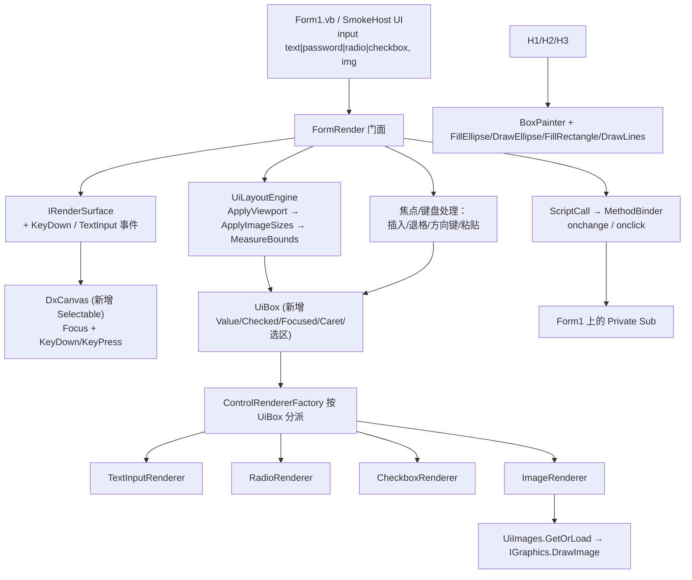

## 产品概述

为 LycheeUI 引擎新增 HTML 输入元素与图片元素：`input`（文本框 / 密码框 / 单选 / 复选）与 `img`。输入元素完全由 DirectX 绘制（模仿 WinForms 控件外观），引擎自实现键盘输入与光标；单选/复选由引擎维护 `checked` 状态（radio 按 `name` 分组互斥），点击时按现有 onclick 机制反射调用宿主方法，并额外暴露查询 API 供宿主读取与设置初值。

## 核心功能

- **文本框 `<input type="text"|"password">`**：带背景与边框（支持圆角）的输入框外观；`password` 用掩码字符；`value` 属性作为初值、`placeholder` 显示灰色提示；点击获得焦点并显示光标，支持字符输入、退格/删除、左右方向键、Home/End、Ctrl+V 粘贴；全部由 DirectX 绘制，无真实 WinForms 控件叠加。
- **单选 `<input type="radio">`**：左侧圆形指示 + 右侧标签文本；按 `name` 属性分组互斥；`checked` 属性设置初值；点击触发 `onchange`/`onclick`。
- **复选 `<input type="checkbox">`**：左侧方形指示 + 对勾 + 右侧标签文本；点击翻转 `Checked`；同样触发 `onchange`/`onclick`。
- **图片 ``**：加载 PNG/JPEG/GIF/BMP 并按 `width`/`height`（或图片自然尺寸）拉伸绘制；加载失败画占位框。
- **宿主 API**：`GetValue(id)` / `SetValue(id, text)` / `GetChecked(id)` / `SetChecked(id, bool)` / `GetFocusedId()` / `SimulateType(text)`。
- **测试用例**：`Form1.vb` 追加全部新元素与宿主处理函数；`Smoke.vb` 生成测试用 PNG 并对新元素做无人值守断言。

## 技术栈

- VB.NET / `net10.0-windows` / WinForms / x64；`LycheeUI.vbproj` 已引用全部依赖，**无需新增 ProjectReference**。
- 布局样式复用 `Microsoft.VisualBasic.MIME.Html.Render.InitialContainer` + `CssBox`（前两轮已从 `#If NET48` 解冻）。
- 绘制：`Microsoft.VisualBasic.Drawing.DirectX.DxCanvas` / `DxGraphics`，经 `Microsoft.VisualBasic.Imaging.IGraphics` 抽象。
- 图片解码：`Microsoft.VisualBasic.Imaging.Driver.ImageDriver.Register()`（GDI+，仅 Windows）。

## 实施方案

### 关键决策与权衡

1. **先 `ImageDriver.Register()` 再 `Dx2DDriver.RegisterDx2D()`**：两者都会 `DriverLoad.Register(..., Drivers.GDI)`，顺序颠倒会让 GDI+ 的 `RasterInterop` 覆盖 DirectX 设备驱动。二者都包在 Try/Catch 里容错。
2. **图片加载自研 `UiImages.GetOrLoad`**，不用 `CssValue.GetImage`（后者语义是反射程序集静态属性、失败返回 50×50 占位，且不受控）。用 `Image.FromFile` + 进程级缓存。
3. **`img` 自然尺寸回填**：LycheeUI 不使用 `CssBox.Paint`，且 `` 盒无文本内容、未声明尺寸时高度会塌成 0。故在 `Relayout` 的 `ApplyViewport` 之后、`MeasureBounds` 之前新增 `ApplyImageSizes()` 预扫描：对 `tag=img` 且 `Width`/`Height` 为 `auto`/空 的盒，把已加载图片的自然尺寸以 `px` 写回 `CssBox.Width/Height`。
4. **`ControlRendererFactory.GetRenderer` 改为按 `UiBox` 分派**：`input` 一个标签对应三种 `type`，必须先看 `box.IsTextInput`/`IsCheckable`/`IsImage` 再看标签名；保留 `GetRenderer(tag)` 与 `Register(tag, renderer)` 兼容旧调用。
5. **文本框选区取舍**：首版只实现「光标位置 + 可选选区起点」——引入 `SelectionStart`/`SelectionLength` 两个字段成本很低（退格、粘贴、Ctrl+A 都要用），但先不做 Shift 方向键扩展选区与鼠标拖拽选区，避免复杂度失控。
6. **光标闪烁**：`FormRender` 内持有一个 `Timer`（约 500ms），仅当存在焦点文本框时运转，切换 `CaretVisible` 并 `Invalidate()`；无焦点时 `Stop()`，避免空转（DirectX 每帧都要重排布局，不能无谓地一直重绘）。
7. **焦点只能有一个**：`FormRender` 维护 `focused As UiBox`；`PointerDown` 命中文本框则聚焦并把点击 x 换算成 `Caret`（`MeasureString` 逐字符累加取最近偏移），命中空白则清除焦点；`DxCanvasSurface` 在 `PointerDown` 时 `canvas.Focus()` 让控件拿到键盘焦点。

### 性能与可靠性

- 图片按 src 缓存，避免每帧解码；布局仍走 CssBox 的惰性缓存，只有尺寸/状态变化才重算。
- 单元素绘制异常隔离不中断整帧；图片加载失败只画占位框并 `Console` 记录一次原因，不重复刷屏。
- `MethodInfo` 仍按 `方法名/参数个数` 缓存，radio/checkbox 的 `onchange` 复用同一 binder。
- 光标 Timer 只在有焦点控件时启动，`Dispose` 时必须 `Stop()` + `Dispose()`，否则窗体关闭后仍会触发。

### 实施注意事项（防回归）

- **类型边界**：`Color/RectangleF/PointF/SizeF` 用 `System.Drawing`；`Font/Pen/Brush/SolidBrush/Image/Bitmap` 必须用 `Microsoft.VisualBasic.Imaging.*`。新增文件顶部要写 `Imports Font = Microsoft.VisualBasic.Imaging.Font`、`Imports Image = Microsoft.VisualBasic.Imaging.Image`、`Imports Pen = ...`、`Imports SolidBrush = ...`（net10.0-windows 下 `System.Drawing.Font`/`Image` 也存在，不别名会 BC30561 二义性）。
- **VB 大小写不敏感**：属性名不得与私有字段同名（前几轮已踩过 `Layout`/`Surface`/`Canvas`/`engine` 的坑）。`UiBox` 新增 `Value`/`Checked`/`Focused` 时字段名要用 `_value`/`_checked`/`_focused` 之类，或直接用自动属性。
- **事件参数命名冲突**：不要叫 `KeyEventArgs`/`KeyPressEventArgs`（与 `System.Windows.Forms` 冲突），用 `CanvasKeyEventArgs` / `CanvasTextEventArgs`。
- **CSS 约定**：圆角可写 `border-radius` 或 `corner-radius`；`border`/`margin`/`padding` 简写可用；`<input>`/`` 放顶层时必须写 `display:block`（`ApplyViewport` 只强制根元素为 block）。
- **`UiBox.IsInteractive` 必须纳入 input**，否则命中测试选不中它们。
- 重绘只能用 `canvas.Invalidate()`。

## 架构设计



## 目录结构

```
G:\Microsoft.VisualBasic.Drawing\src\DxCanvas\
└── DxCanvas.vb                       # [MODIFY] 构造函数追加 SetStyle(ControlStyles.Selectable Or
                                      #          ControlStyles.UserMouse, True)；重写 IsInputKey 放行
                                      #          方向键/Home/End，重写 OnKeyDown 设 e.Handled/SuppressKeyPress

g:\lychee\src\LycheeUI\
├── Render\IRenderSurface.vb          # [MODIFY] 新增 Event KeyDown As EventHandler(Of CanvasKeyEventArgs)
│                                     #          与 Event TextInput As EventHandler(Of CanvasTextEventArgs)
├── Render\CanvasKeyEventArgs.vb      # [NEW] Keys/Alt/Control/Shift/Handled（避免与 WinForms KeyEventArgs 同名）
├── Render\CanvasTextEventArgs.vb     # [NEW] Char/Handled
├── Render\DxCanvasSurface.vb         # [MODIFY] 转发 canvas.KeyDown/KeyPress；PointerDown 时 canvas.Focus()
├── Render\DxWindowSurface.vb         # [MODIFY] 同步转发键盘事件
├── Layout\UiBox.vb                   # [MODIFY] 新增 Value/Checked/Focused/Caret/SelectionStart/SelectionLength；
│                                     #          只读 InputType/GroupName/Src/IsTextInput/IsCheckable/IsImage；
│                                     #          IsInteractive 纳入 input
├── Layout\UiLayoutEngine.vb          # [MODIFY] GetView 按 value/checked/type/name 初始化状态；新增 ApplyImageSizes()；
│                                     #          新增 FindById(id) 供引擎与冒烟共用
├── Controls\TextInputRenderer.vb     # [NEW] 背景+边框+文本/掩码+placeholder+光标竖线
├── Controls\RadioRenderer.vb         # [NEW] 圆 + 选中内圆点 + 标签文本
├── Controls\CheckboxRenderer.vb      # [NEW] 方框 + 对勾 + 标签文本
├── Controls\ImageRenderer.vb         # [NEW] DrawImage 拉伸绘制 / 失败占位框
├── Controls\UiImages.vb              # [NEW] Shared GetOrLoad(src) + 进程级缓存 + 路径解析（原样/基目录/嵌入资源）
├── Controls\ControlRendererFactory.vb# [MODIFY] GetRenderer(box As UiBox) 按状态分派；保留 GetRenderer(tag)
└── FormRender.vb                     # [MODIFY] EnsureDrivers（先 ImageDriver 后 Dx2DDriver）；焦点与键盘处理；
                                      #          光标 Timer；GetValue/SetValue/GetChecked/SetChecked/
                                      #          GetFocusedId/SimulateType；Dispose 释放 Timer

g:\lychee\test\
├── Form1.vb                          # [MODIFY] 新增 input(text/password/radio×2/checkbox×2) 与 img；
│                                     #          新增宿主 Private Sub（文本变更、选中回调）
└── Smoke.vb                          # [MODIFY] 生成测试用 PNG；新增断言（初值、翻转、radio 互斥、查询 API、
                                      #          SimulateType、图片区域像素）
```

## 关键代码结构

```
' ---------- Render\CanvasKeyEventArgs.vb ----------
Public Class CanvasKeyEventArgs : Inherits EventArgs
    Public ReadOnly Property KeyCode As Keys
    Public ReadOnly Property Alt As Boolean
    Public ReadOnly Property Control As Boolean
    Public ReadOnly Property Shift As Boolean
    Public Property Handled As Boolean
End Class

' ---------- Render\CanvasTextEventArgs.vb ----------
Public Class CanvasTextEventArgs : Inherits EventArgs
    Public ReadOnly Property Char As Char    ' 可打印字符，控制字符不会到达这里
    Public Property Handled As Boolean
End Class

' ---------- Layout\UiBox.vb 新增状态 ----------
Public Property Value As String            ' 文本框内容；checkbox/radio 为 "True"/"False"
Public Property Checked As Boolean
Public Property Focused As Boolean
Public Property Caret As Integer           ' 光标在 Value 中的偏移
Public Property SelectionStart As Integer
Public Property SelectionLength As Integer

' 只读辅助（均从 html 属性读）
Public ReadOnly Property InputType As String   ' type 属性，默认 "text"
Public ReadOnly Property GroupName As String   ' name 属性，radio 分组用
Public ReadOnly Property Src As String         ' img 的 src
Public ReadOnly Property Placeholder As String
Public ReadOnly Property IsTextInput As Boolean   ' tag=input 且 type 为 text/password
Public ReadOnly Property IsCheckable As Boolean   ' tag=input 且 type 为 radio/checkbox
Public ReadOnly Property IsImage As Boolean       ' tag=img

' IsInteractive 需扩展（否则命中测试选不中）
Public ReadOnly Property IsInteractive As Boolean
    Get
        Return Tag = "button" OrElse Tag = "input" OrElse
               Not String.IsNullOrEmpty(OnClick) OrElse Not String.IsNullOrEmpty(OnChange)
    End Get
End Property
```

```
' ---------- Controls\ControlRendererFactory.vb：按 UiBox 分派 ----------
Public Function GetRenderer(box As UiBox) As IControlRenderer
    If box Is Nothing Then Return Fallback
    If box.IsImage Then Return imgRenderer
    If box.IsCheckable Then
        Return If(box.InputType = "radio", radioRenderer, checkRenderer)
    End If
    If box.IsTextInput Then Return textRenderer
    Return GetRenderer(box.Tag)
End Function
```

```
' ---------- Controls\UiImages.vb ----------
Public Module UiImages
    Private ReadOnly cache As New Dictionary(Of String, Image)()

    Public Function GetOrLoad(src As String) As Image
        ' 解析顺序：原样路径 → AppDomain.CurrentDomain.BaseDirectory 相对路径 → 程序集嵌入资源
        ' 命中缓存直接返回；失败返回 Nothing 并只记录一次原因
    End Function
End Module
```

```
' ---------- FormRender.vb：驱动注册顺序不可颠倒 ----------
Private Shared Sub EnsureDrivers()
    If driversReady Then Return
    driversReady = True
    Try : Call ImageDriver.Register() : Catch ex As Exception : End Try   ' 先 GDI+ 图片解码
    Try : Call Dx2DDriver.RegisterDx2D() : Catch ex As Exception : End Try ' 后 DirectX 设备
End Sub
```

## 执行顺序与验证

| 步骤 | 产出 | 验证命令 |
| --- | --- | --- |
| 1 | DxCanvas 补 Selectable/IsInputKey/OnKeyDown | `dotnet build G:\Microsoft.VisualBasic.Drawing\src\DxCanvas\DxCanvas.vbproj` |
| 2 | IRenderSurface 键盘事件 + 两个事件参数类 + 两个 Surface 转发 | `dotnet build g:\lychee\src\LycheeUI\LycheeUI.vbproj` |
| 3 | UiBox 状态 + UiLayoutEngine 初始化/ApplyImageSizes/FindById | 同上 |
| 4 | UiImages + 四个新渲染器 + Factory 分派 | 同上 |
| 5 | FormRender 焦点/键盘/光标 Timer/查询 API | 同上 |
| 6 | Form1.vb 与 Smoke.vb 用例 | `dotnet build g:\lychee\test\test.vbproj -c Debug` |
| 7 | 冒烟 + 像素采样 | `test.exe --smoke`（退出码 0）+ PowerShell 采样 `lychee-smoke.png` |


**冒烟新增断言**：先用 `Imaging.Bitmap` 生成一张 64×64 纯色 PNG 存到输出目录（避免往仓库放二进制资源），UI 里以相对路径引用；断言初始 `value`/`checked`、`SimulateClick` 后 `Checked` 翻转、同 `name` 的 radio 互斥、`GetValue`/`GetChecked` 一致、`SimulateType("abc")` 后文本与 `Caret` 更新、图片区域像素非背景色。

**人工验收**：运行 test 项目打开 `Form1`，点击文本框输入文字（含退格/方向键/粘贴）、点击 checkbox 与 radio 查看状态变化与宿主回调、确认图片显示。

## Agent Extensions

### SubAgent

- **code-explorer**
- 用途：动手改 `G:\Microsoft.VisualBasic.Drawing\src\DxCanvas\DxCanvas.vb` 前，确认构造函数里 `SetStyle` 的确切位置、`DxScene3DCanvas.vb` 里 `OnKeyDown`/`IsInputKey` 的既有写法；改 `UiLayoutEngine` 前确认 `CssBox.Width`/`Height` 属性名与 `CssConstants.Auto` 常量；实现 `UiImages` 前确认 `Imaging.Image.FromFile` / `Imaging.Bitmap` 的构造与 `ImageFormats.Png` 的确切命名空间。
- 预期结果：拿到可直接粘贴的、与既有实现风格一致的 VB 代码片段，每步一次编译通过，不凭记忆写错 API。