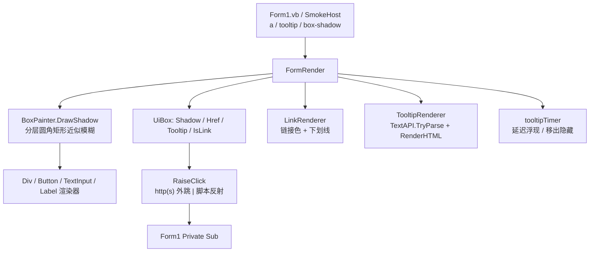

## 产品概述

为 LycheeUI 引擎新增三类能力并配套测试：

1. **超链接控件**：模拟 WinForms LinkLabel 的 `<a>` 元素。`href` 以 `http(s)://` 开头时用 `Process.Start(UseShellExecute:=True)` 打开浏览器，否则按脚本表达式反射调用宿主方法；提供 `OpenLinks As Boolean` 开关供宿主禁用外跳。视觉上为链接色文本 + 下划线，hover 变色。
2. **富文本 tooltip**：新增 `tooltip` 属性，值是一段迷你 HTML（`<b>/<i>/<sub>/<sup>/<font color>/<br>`），复用 html 库 `TextAPI.TryParse` + `RenderHTML` 绘制；tooltip 由引擎画在当前画布内，位置跟随鼠标并自动夹紧在视口内，延迟浮现、移出或点击即隐藏。
3. **CSS box-shadow 阴影**：新增 `box-shadow` 属性（offset-x offset-y blur color），用 N 层逐层扩大且透明度递减的圆角矩形叠加近似模糊，画在控件填充层之下；Div/Button/TextInput/Label 渲染器接入。

## 核心功能

- `<a href="...">文本</a>`：可点击、可 hover、可被命中测试选中，href 双语义可配置。
- 任意元素声明 `tooltip="..."` 后，鼠标悬停指定延迟即浮现富文本提示，移出/点击消失。
- 任意元素声明 `box-shadow: dx dy blur color` 后，控件下方出现柔和阴影。
- 冒烟与像素级验证全覆盖。

## 技术栈

- VB.NET / `net10.0-windows` / WinForms / x64；`LycheeUI.vbproj` 已引用全部依赖，无需新增 ProjectReference。
- 布局复用 `InitialContainer` + `CssBox`；绘制经 `Microsoft.VisualBasic.Imaging.IGraphics`（DirectX 后端 `DxGraphics`）。
- 富文本复用 `Microsoft.VisualBasic.MIME.Html.Render.TextAPI.TryParse` + `Microsoft.VisualBasic.Imaging.Drawing2D.Text.HTMLRender.RenderHTML/MeasureSize`（未被 `#If NET48` 包裹，走 IGraphics）。

## 实施方案

### 关键决策与权衡

1. **`BoxShadow` 放在 html 库的 `CssBox` 上，解析放 LycheeUI**：`CssPropertyAttribute` 是级联引擎落到属性的依据，缺了 `style="box-shadow:..."` 取不到值；但 UI 专属语法不耦合进 html 库，LycheeUI 拿原始字符串自己解析。
2. **box-shadow 值 tokenizer 必须把括号组当整体**：`rgba(0, 0, 0, 0.5)` 含空格，直接 `Split(" "c)` 会碎裂；`CssValue.SplitValues` 不处理括号，需自写小型 tokenizer。
3. **阴影用分层矩形而非高斯卷积**：`IGraphics`/`DxGraphics` 无模糊原语；分层半透明圆角矩形由 DirectX 直接绘制，无每帧位图成本。
4. **tooltip 画在画布内而非独立窗体**：swap chain 绑定宿主 HWND，画布外无法呈现；画布内夹紧位置不引入新渲染表面。tooltip 面板不是 UiBox、不参与布局与命中，必须在 `handleFrame` 所有控件画完之后绘制。
5. **阴影字段缓存**：`UiBox.Shadow` 只在首次访问时解析（`Single.NaN` 式惰性缓存），避免每帧重复解析字符串。
6. **链接外跳**：.NET Core 下 `Process.Start(url)` 默认 `UseShellExecute=False` 会抛 `Win32Exception`，必须显式 `UseShellExecute = True`，并 Try/Catch 容错。

### 性能与可靠性

- tooltip Timer 只在悬停于带 `tooltip` 的控件时启动，移出/点击即停；`Dispose` 释放；tick 内 Try/Catch + Stop（照抄 `handleCaretTick` 模式），宿主关闭后不得崩溃。
- 阴影层数 `clamp(CInt(Blur / 1.5F), 1, 8)`，层数受控；解析失败返回 `IsEmpty = True` 默认值，不抛异常。
- 链接外跳失败写 Console 不崩溃；tooltip 内容为空时不启动 Timer。

### 架构设计



### 目录结构

```
G:\GCModeller\src\runtime\sciBASIC#\mime\text%html\Render\CSS\
└── CssBox.vb                        # [MODIFY] 新增 <CssProperty("box-shadow")> BoxShadow 自动属性

g:\lychee\src\LycheeUI\
├── Layout\CssShadow.vb              # [NEW] Structure CssShadow(OffsetX,OffsetY,Blur,Color) + IsEmpty + Parse(text)
│                                    #        括号组整体 token 化的小型 tokenizer
├── Layout\UiBox.vb                  # [MODIFY] Shadow(惰性缓存)/Href/Tooltip/IsLink；IsInteractive 追加 Tag="a"
├── Controls\BoxPainter.vb           # [MODIFY] 新增 DrawShadow(g, box, bounds)
├── Controls\DivRenderer.vb          # [MODIFY] FillBox 之前调 DrawShadow
├── Controls\ButtonRenderer.vb       # [MODIFY] 同上
├── Controls\TextInputRenderer.vb    # [MODIFY] 同上
├── Controls\LabelRenderer.vb        # [MODIFY] 同上
├── Controls\LinkRenderer.vb         # [NEW] LinkColor/ActiveLinkColor/Underline + 下划线绘制
├── Controls\TooltipRenderer.vb      # [NEW] Shared Measure(g,text,font) / Shared Render(g,text,font,location,viewport)
├── Controls\ControlRendererFactory.vb # [MODIFY] 注册 "a" → LinkRenderer
└── FormRender.vb                    # [MODIFY] OpenLinks/tooltipTimer/TooltipDelay/SimulateHover/
                                     #        TooltipVisible/TooltipText；RaiseClick 的链接分支；handleFrame 末尾画 tooltip

g:\lychee\test\
├── Form1.vb                         # [MODIFY] <a>、tooltip、box-shadow；宿主 Private Sub openHelp(topic)
└── Smoke.vb                         # [MODIFY] <a>/tooltip/box-shadow 断言 + 像素采样
```

### 关键代码结构

```
' Layout\CssShadow.vb
Public Structure CssShadow
    Public OffsetX As Single
    Public OffsetY As Single
    Public Blur As Single
    Public Color As Color
    Public ReadOnly Property IsEmpty As Boolean
    Public Shared Function Parse(text As String) As CssShadow
    '  tokenizer：遇到 "(" 累积到 ")"，其余按空白拆分
End Structure

' Layout\UiBox.vb
Private _shadow As CssShadow
Private _shadowResolved As Boolean = False
Public ReadOnly Property Shadow As CssShadow
    Get
        If Not _shadowResolved Then
            _shadow = CssShadow.Parse(Source.BoxShadow)
            _shadowResolved = True
        End If
        Return _shadow
    End Get
End Property
Public ReadOnly Property Href As String        ' Source.GetAttribute("href")
Public ReadOnly Property Tooltip As String     ' Source.GetAttribute("tooltip")
Public ReadOnly Property IsLink As Boolean     ' Tag = "a"

' Controls\BoxPainter.vb
Public Sub DrawShadow(g As IGraphics, box As UiBox, bounds As RectangleF)
    '  N = clamp(CInt(blur / 1.5F), 1, 8)
    '  第 i 层：扩张 i*blur/N，alpha *= (1 - i/N)，偏移按比例推进
    '  FillRoundedRectangle(radius = box.Radius + 扩张量)，无 DxGraphics 时退化 FillRectangle
End Sub

' Controls\TooltipRenderer.vb
Public Shared Function Measure(g As IGraphics, text As String, font As Font) As SizeF
Public Shared Sub Render(g As IGraphics, text As String, font As Font,
                         location As PointF, viewport As Size)
'  Measure: padding*2 + g.MeasureSize(TextAPI.TryParse(text, font, Color.Black))
'  Render:  夹紧到 viewport → 阴影 → 背景 → 边框 → g.RenderHTML(tokens, New PointF(x+pad, y+pad))

' FormRender.vb
Public Property OpenLinks As Boolean = True
Public Property TooltipDelay As Integer = 600
Public ReadOnly Property TooltipVisible As Boolean
Public ReadOnly Property TooltipText As String
Public Sub SimulateHover(x As Integer, y As Integer)
'  RaiseClick: box.IsLink 且 href 以 http(s):// 开头且 OpenLinks → Process.Start(New ProcessStartInfo(href) With {.UseShellExecute = True})
'              javascript: 前缀剥掉后走 binder.Invoke
'  handleFrame 末尾: If TooltipVisible Then TooltipRenderer.Render(...)
```

### SubAgent

- **code-explorer**
- 用途：动手改 `CssBox.vb` 前确认 `CssPropertyAttribute`/`DefaultValueAttribute` 的既有写法与插入位置；确认 `TextAPI.TryParse` 的确切签名与 `TextString.WeightStyles` 枚举成员名；确认 `g.MeasureSize`/`RenderHTML` 扩展方法的命名空间导入要求。
- 预期结果：拿到与既有实现风格一致、可直接粘贴的 VB 代码片段，每步一次编译通过。