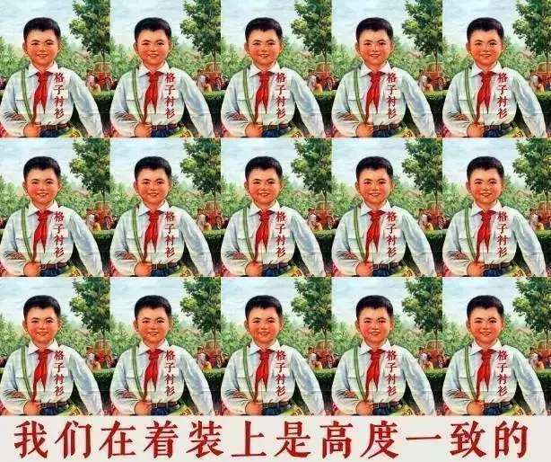
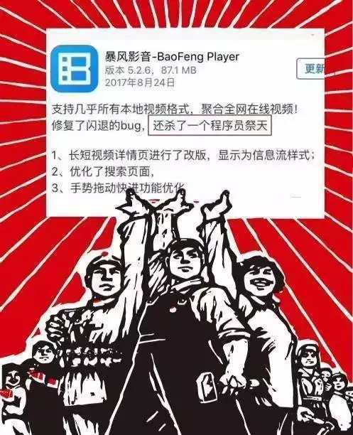
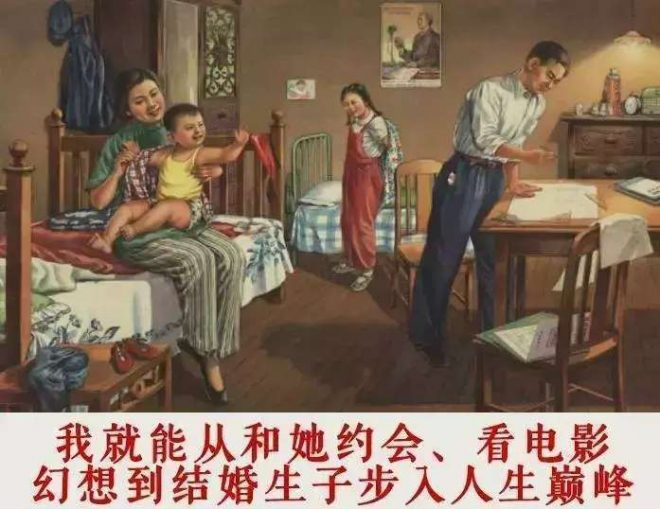
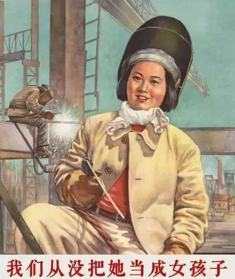
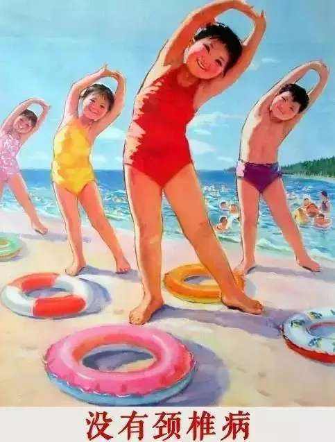

# 对文艺程序员的一次访谈

> http://codebay.cn/post/8535.html

最近我对一位资深程序员就工作生活问题进行了深度采访，采访内容如下：

> Q：请问你工作多久了？ 
> A：5年了

> Q：你觉得，程序员这份工作对你有什么影响吗？ 
> A：有

> Q：那你的生活有什么改变吗？ 
> A：也有

> Q：说到地铁，听说你们北京的程序员都在西二旗上班？ 
> A：是的

> Q：那你们每天上下班挤地铁都很辛苦喽？ 
> A：想什么呢？

> Q：那你的夜生活，也全是在公司加班吗？ 
> A：是啊

> Q：你这么拼，公司待遇肯定很好吧！ 
> A：并没有

> Q：那你们伙食呢？听说西二旗的伙食很好？ 
> A：这个嘛

> Q：你们程序员有什么特点呢？ 
> A：别的不说

> Q：你觉得程序员最有意思的地方是什么？ 
> A：难道你不知道

> Q：呃，既然这样我们还是聊点别的吧！ 
> A：可以！ 
> Q：你对爱情向往吗？ 
> A：那当然了！

> Q：你们公司难道没有女程序员吗？ 
> A：也有那么一两个

> Q：那你为什么不找对象呢？

> Q：好吧，那如果让你用一个词来总结，成为一个好程序员的要素，你会用哪个？ 
> A：装 
> Q：装？ 
> A：对，装

> Q：说了这么多，你的人生目标是什么？

> 等等 
> 还是换成这个吧！

